\newpage

# Water- en Zoutbalans {#Waterkwaliteit}

```{r setupWaterkwaliteit, include = FALSE}

theme_wq = theme_bw()
```

!!! DIT IS EEN TESTVERSIE !!!

```{r readWQData}
# ddl\standard\WQ_TS_trendstations_allyears.csv
path <- "https://watersysteemdata.deltares.nl/thredds/fileServer/watersysteemdata/Wadden/ddl/standard/WQ_TS_trendstations_allyears.csv"
# path <- file.path( datadir, "ddl", "standard/", "WQ_TS_trendstations_allyears.csv")
WQ <- read_delim(path, delim = ";", guess_max = 1000000, na = c("999999999999", "999999e32"))
ZS <- read_delim(file.path(datadir, "RWS", "standard", "ZS_all.csv"), delim = ";") %>%
  mutate(kwaliteitswaarde.code = as.character(kwaliteitswaarde.code))

WQ <- WQ %>% bind_rows(ZS)

# ddl\standard\WQ_TS_trendstations_allyears.csv
path_IJS <- "https://watersysteemdata.deltares.nl/thredds/fileServer/watersysteemdata/IJsselmeer/locaties_debiet.csv"
# path <- file.path( datadir, "ddl", "standard/", "WQ_TS_trendstations_allyears.csv")
WQ_IJS <- read_delim(path_IJS, delim = ";", guess_max = 1000000, na = c("999999999999", "999999e32"))

```

## Afbakening, definitie en herkomst

!!! DIT IS EEN TESTVERSIE !!!

**Belang**

**Afbakening**

**Databronnen**
figuur \@ref(fig:kaartDDLlocaties)

```{r kaartDDLlocaties, cache=F, fig.cap = "Huidige locaties met MWTL metingen in de relevante delen van de Noordzee, de Waddenzee en het Eems-estuarium."}

plotlocaties = c("Vliestroom", "Marsdiep noord", "Doove Balg west", "Dantziggat", "Boomkensdiep", "Terschelling 10 km uit de kust","Rottumerplaat 3 km uit de kust", "Huibertgat oost", "Bocht van Watum", "Groote Gat noord")

WQlocations <- WQ %>%
  distinct(locatie.code, locatie.naam, geometriepunt.x, geometriepunt.y, grootheid.code, parameter.code) %>% st_as_sf(coords = c("geometriepunt.x", "geometriepunt.y"), crs = 4326) %>%
  filter(locatie.naam %in% plotlocaties)
# 
# leaflet::leaflet(WQlocations) %>%
#   leaflet::addTiles(group = "OSM") %>%
#   # addProviderTiles(providers$Esri.WorldTopoMap, group = "Esri.WorldTopoMap") %>%
#   # addProviderTiles(providers$Esri.WorldImagery, group = "Esri.WorldImagery") %>%
#   # leaflet::addProviderTiles("OpenSeaMap", group = "OpenSeaMap") %>%
#   leaflet::addCircleMarkers(label = ~htmltools::htmlEscape(paste0(locatie.naam)), group = "all_locations", radius = 4, labelOptions = labelOptions(noHide = T, direction = 30)) #%>%
#   # leaflet::addLayersControl(
#   #   baseGroups = c("OSM",  "Esri.WorldTopoMap", "Esri.WorldImagery"),
#   #   overlayGroups = c("all_locations", "watersysteem", "OpenSeaMap")) %>%    #, "KRW waterlichamen 2006"
#   # hideGroup("KRW waterlichamen 2006")


WQlocations_IJS <- WQ_IJS %>%
  distinct(naam, X, Y,) %>% st_as_sf(coords = c("X", "Y"), crs = 4326)

leaflet::leaflet(WQlocations_IJS) %>%
  leaflet::addTiles(group = "OSM") %>%
  # addProviderTiles(providers$Esri.WorldTopoMap, group = "Esri.WorldTopoMap") %>%
  # addProviderTiles(providers$Esri.WorldImagery, group = "Esri.WorldImagery") %>%
  # leaflet::addProviderTiles("OpenSeaMap", group = "OpenSeaMap") %>%
  leaflet::addCircleMarkers(label = ~htmltools::htmlEscape(paste0(naam)), group = "all_locations", radius = 4, labelOptions = labelOptions(noHide = T, direction = 30)) #%>%
  # leaflet::addLayersControl(
  #   baseGroups = c("OSM",  "Esri.WorldTopoMap", "Esri.WorldImagery"),
  #   overlayGroups = c("all_locations", "watersysteem", "OpenSeaMap")) %>%    #, "KRW waterlichamen 2006"
  # hideGroup("KRW waterlichamen 2006")

```
## Water {#water}

!!! DIT IS EEN TESTVERSIE !!!

```{r 01-Debiet-IJssel, echo=FALSE, fig.cap="debiet IJssel gemeten bij Olst"}
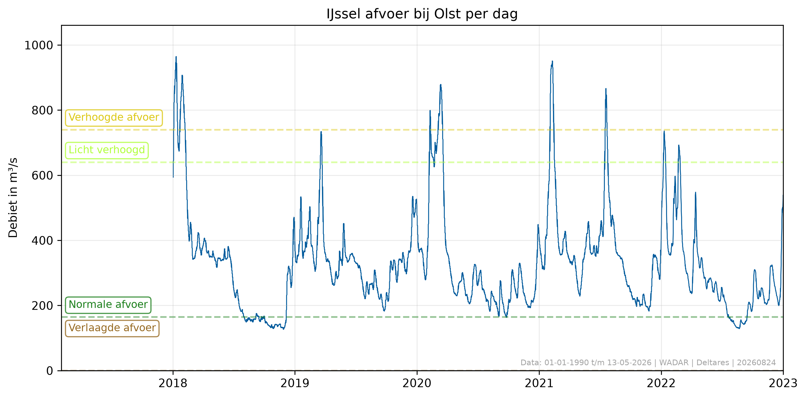
```

```{r 02-Debiet-Lorentzsluizen, echo=FALSE, fig.cap="debiet Lorentz spuisluizen"}
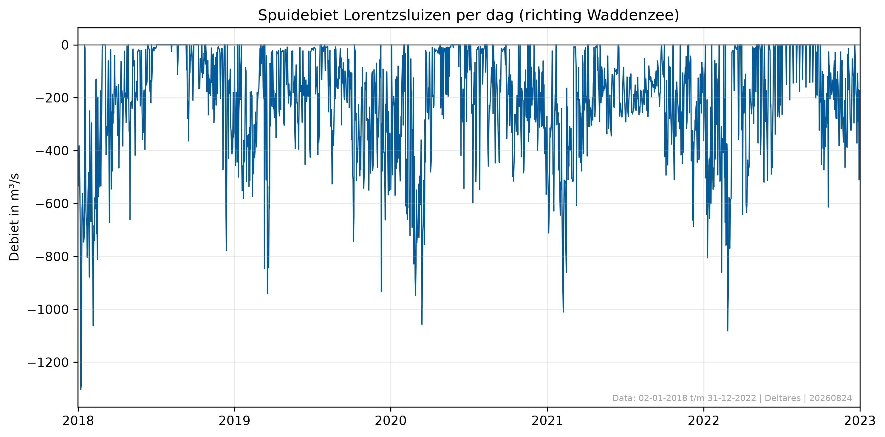
```

```{r 03-Debiet-Stevinssluizen, echo=FALSE, fig.cap="debiet Stevin spuisluizen"}
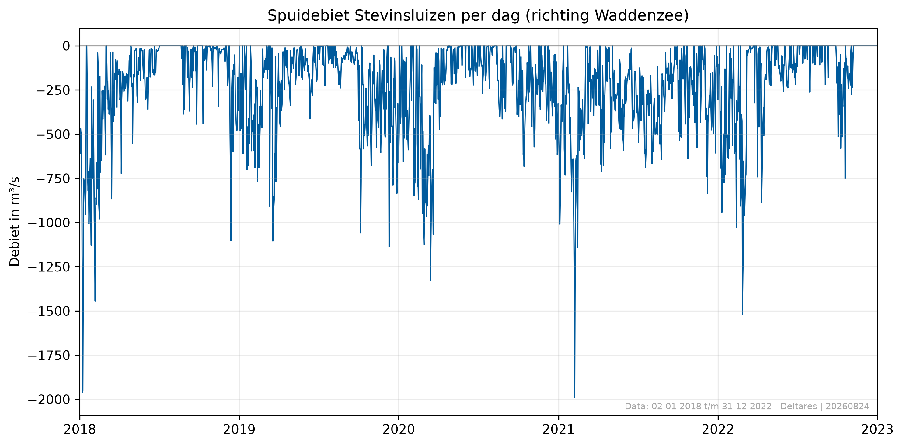
```

```{r 04-Debiet-Houtribsluis, echo=FALSE, fig.cap="debiet Houtribsluis noord"}
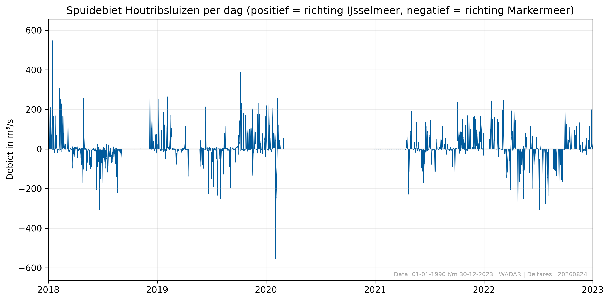
```

```{r 05-Debiet-Krabbersgatsluizen, echo=FALSE, fig.cap="debiet Krabbersgat"}
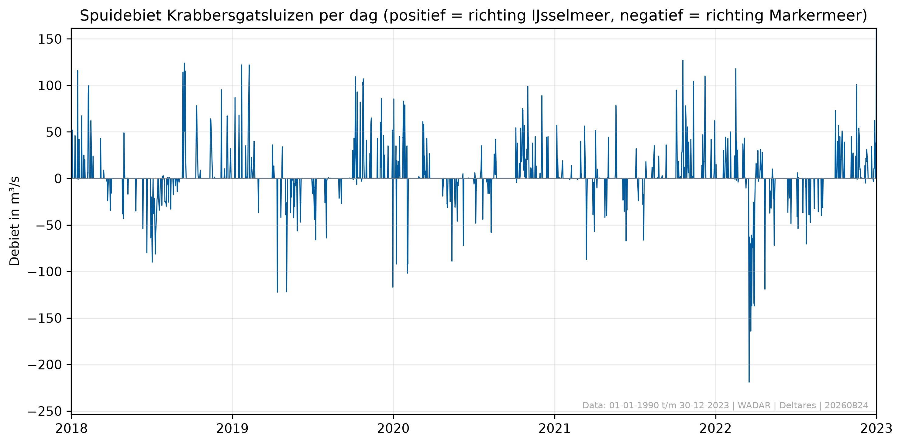
```

```{r 06-Debiet-overig, echo=FALSE, fig.cap="debiet overige locaties"}
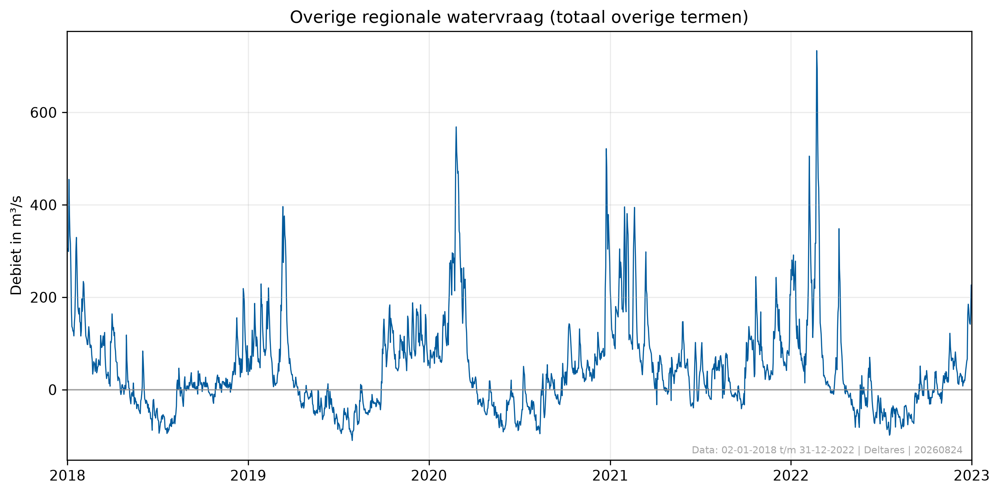
```

#### Berging/Meerpeil
```{r 01-Berging-IJsselmeer, echo=FALSE, fig.cap="Berging IJsselmeer"}
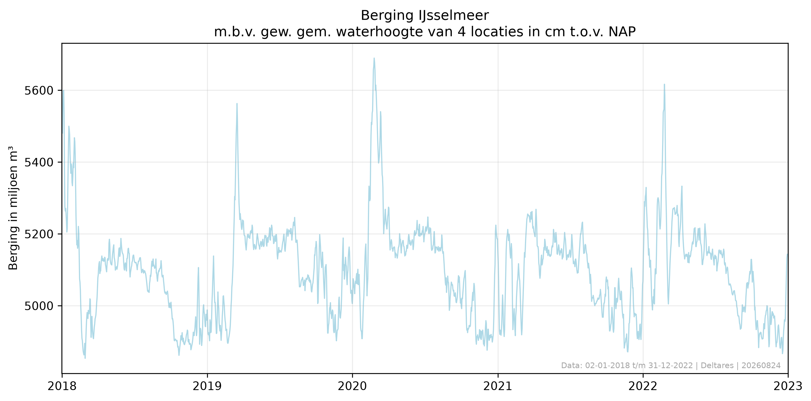
```

#### Meteorologie
```{r 01-Neerslag, echo=FALSE, fig.cap="Neerslag op dagbasis IJsselmeer"}
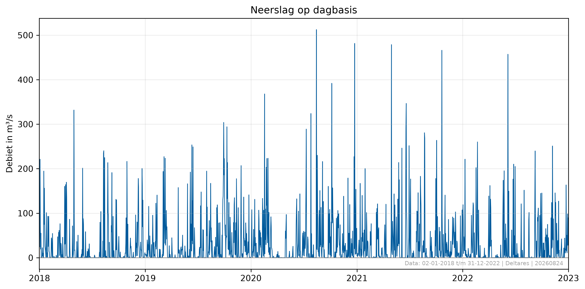
```

```{r 02-Verdamping, echo=FALSE, fig.cap="Verdamping op dagbasis IJsselmeer"}
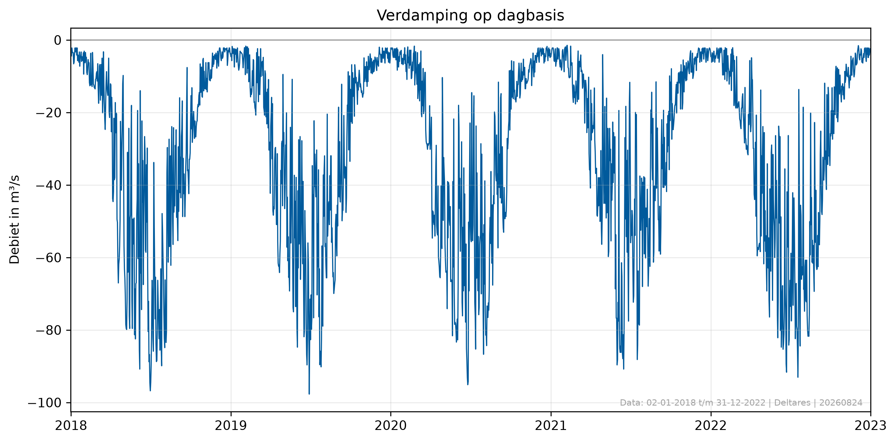
```

#### Waterbalans

```{r 01-waterbalans-abs, echo=FALSE, fig.cap="Maandelijkse in- en uitstroom absoluut"}
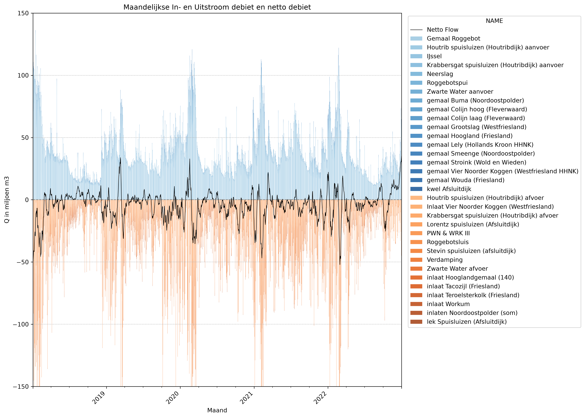
```

```{r 02-waterbalans-rel, echo=FALSE, fig.cap="Maandelijkse in- en uitstroom relatief"}
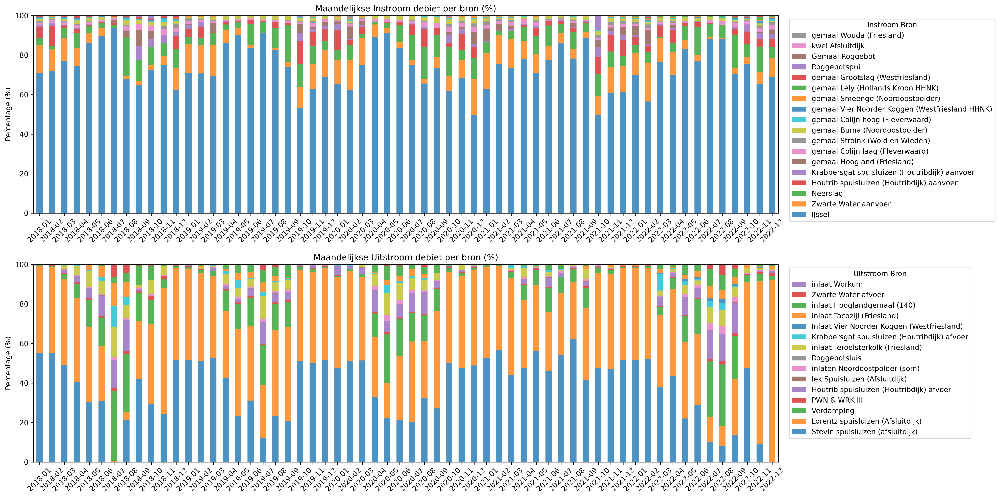
```

## Wind {#wind}

!!! DIT IS EEN TESTVERSIE !!!

De onderstaande figuren tonen de ontwikkeling van windsnelheid en windrichting op meetlocaties in en rond het IJsselmeergebied. Wind is een belangrijke sturende factor binnen het watersysteem en heeft invloed op onder andere waterstanden, golfopbouw, menging van de waterkolom en de verspreiding van stoffen. De tijdreeksen laten zowel seizoensgebonden patronen als kortdurende stormachtige gebeurtenissen zien. Door de ontwikkelingen door de tijd te volgen en verschillende locaties met elkaar te vergelijken, ontstaat inzicht in de ruimtelijke en temporele variatie van de windcondities en hun mogelijke invloed op het functioneren van het watersysteem.

```{r interactive-wind, echo=FALSE, results='asis'}
cat(
  '<iframe
      src="images/wind/wind_speed_direction_Stavoren_IJsselmeer.html"
      width="100%"
      height="650px"
      style="border:none;">
   </iframe>'
)
```


```{r wind, echo=FALSE}
# imgs <- list.files(
#   "images/wind",
#   pattern = "\\.png$",
#   full.names = TRUE
# )
# 
# knitr::include_graphics(imgs)
```


## Zout {#zout}

!!! DIT IS EEN TESTVERSIE !!!

### MWTL-metingen

De metingen (figuur \@ref(fig:jaargemiddeldeSal)) laten een seizoensfluctuatie van enkele ppt zien die gekoppeld is aan de seizoensfluctuatie in de zoetwaterafvoeren. De jaargemiddelde saliniteitswaarden laten fluctuaties zien zoals de dip rond 1995, maar langjarige trends zijn niet duidelijk zichtbaar. Daartoe wordt ook de afwijking van het jaargemiddelde ten opzichte van het langjarig gemiddelde uitgezet (figuur \@ref(fig:plotSaliniteitAnomalie)). Hierin is de dip rond 1995 duidelijker terug te zien, maar lijkt de saliniteit in de Wadden sinds 2003 ook licht toe te nemen. Vooral in het Eems-estuarium zijn de relatieve afwijkingen groot, tot een factor 5. In de Waddenzee zijn de afwijkingen verder in de bekkens, op locaties dichter bij de spuilocaties, zoals te verwachten ook groter dan op de Noordzee en nabij de zeegaten. De saliniteit lijkt de laatste jaren bij station Doove Balg toe nemen, wat overeenkomt met een afname in het spuidebiet bij Den Oever (zie \@ref(zoetwaterafvoeren)).

```{r jaargemiddeldeSal, fig.height=20, fig.width=10, fig.cap="Jaargemiddelde saliniteit in de Waddenzee. Maandgemiddelden (punten) en individuele metingen (kleinste punten) geven het bereik aan. Jaargemiddelde is alleen berekend bij meer dan 10 metingen per jaar. "}
# 
# 
# plotlocaties = c("Vliestroom", "Marsdiep noord", "Doove Balg west", "Dantziggat", "Boomkensdiep", "Terschelling 10 km uit de kust","Rottumerplaat 3 km uit de kust", "Huibertgat oost", "Bocht van Watum", "Groote Gat noord")
# 
# par = "NVT"
# gro = "SALNTT"
# parlabel = "saliniteit in PSU"
# xlabel = "jaar"
# 
# parData <- WQ %>% 
#   filter(parameter.code == par, grootheid.code == gro, as.numeric(kwaliteitswaarde.code) < 50) %>%
#   filter(locatie.naam %in% plotlocaties) %>%
#   arrange(geometriepunt.x) %>%
#   mutate(jaar = year(tijdstip), maand = month(tijdstip)) %>%
#   mutate(locatie.naam = factor(locatie.naam, levels = plotlocaties))
# 
#   ggplot() +
#     geom_point(data = parData, aes(as.Date(tijdstip), numeriekewaarde, color = "individuele metingen"), alpha = 1, size = 0.65) +
#     geom_point(data = parData %>%
#                  group_by(locatie.naam, jaar, maand) %>% summarize(maandgemiddelde = mean(numeriekewaarde), n = n()),
#                aes(as.Date(lubridate::ymd(paste(jaar, maand, "15"))), maandgemiddelde, color = "maandgemiddelde"), size = 1
#     ) +
#     geom_line(data = parData %>%
#                 group_by(locatie.naam, jaar, maand) %>% summarize(maandgemiddelde = mean(numeriekewaarde), n = n()) %>% ungroup() %>%
#                 group_by(locatie.naam, jaar) %>% summarize(jaargemiddelde = mean(maandgemiddelde), `n/jaar` = sum(n)) %>% ungroup() %>%
#                 filter(`n/jaar` > 10),
#               aes(as.Date(lubridate::ymd(paste(jaar, "07", "01"))), jaargemiddelde, color = "jaargemiddelde"), size = 1.5, alpha = 0.8
#     ) +
#     coord_cartesian(ylim = c(5,NA)) +
#     ylab(parlabel) + xlab(xlabel) +
#     facet_wrap(~ locatie.naam, ncol = 1) +  #scales = "free",
#     theme_wq +
#     theme(legend.position = "bottom") +
#     scale_colour_manual(name = "",
#                         values = c("maandgemiddelde" = "black", 
#                                    "jaargemiddelde" = "red",
#                                    "metingen" = "darkgrey")) +
#     guides(colour = guide_legend(override.aes = list(shape = 1, size = 3)))
# 
```

```{r plotSaliniteitAnomalie, fig.margin=TRUE, fig.height = 20, fig.width = 10, fig.cap="Anomalie (afwijking van het langjarig gemiddelde) van saliniteit voor de gehele meetperiode"}
# 
# plotlocaties = c("Vliestroom", "Marsdiep noord", "Doove Balg west", "Dantziggat", "Boomkensdiep", "Terschelling 10 km uit de kust","Rottumerplaat 3 km uit de kust", "Huibertgat oost", "Bocht van Watum", "Groote Gat noord")
# 
# par = "NVT"
# grp = "SALNTT"
# parlabel = "anomalie salinteit"
# jet.colors <- colorRampPalette(c("#00007F", "blue", "#007FFF", "cyan", "#7FFF7F", "yellow", "#FF7F00", "red", "#7F0000"))
# my_breaks = c(5, 10, 15, 20, 25, 30)
# k = 13
# 
# WQ %>%
#   dplyr::select(tijdstip, locatie.naam, grootheid.code, parameter.code, eenheid.code, geometriepunt.x, geometriepunt.y, coordinatenstelsel, bemonsteringshoogte, referentievlak, kwaliteitswaarde.code, numeriekewaarde) %>%
#   dplyr::filter(parameter.code == par, grootheid.code == gro, as.numeric(kwaliteitswaarde.code) < 50, year(tijdstip) >= 1989) %>%
#   dplyr::filter(locatie.naam %in% plotlocaties) %>%
#   dplyr::mutate(jaar = year(tijdstip), maand = month(tijdstip)) %>%
#   # mutate(logwaarde = log(numeriekewaarde)+0.001) %>%
#   dplyr::group_by(locatie.naam, jaar, maand) %>% dplyr::summarize(maandgemiddelde = mean(numeriekewaarde)) %>% ungroup() %>%
#   dplyr::group_by(locatie.naam) %>% dplyr::mutate(anomalie = maandgemiddelde - mean(maandgemiddelde)) %>% ungroup() %>% 
#   tidyr::complete(locatie.naam, jaar, maand, fill = list(maandgemiddelde = NA, anomalie = NA)) %>% 
#   mutate(datum = as.Date(lubridate::ymd(paste(jaar, maand, "15")))) %>%
#   arrange(locatie.naam, datum) %>%
#   # mutate(anomalie = oce::fillGap(anomalie)) %>%
#   group_by(locatie.naam) %>% mutate(rM=rollmean(anomalie,k, na.pad=TRUE, align="center", na.rm = T)) %>%
#   mutate(locatie.naam = factor(locatie.naam, levels = plotlocaties)) %>% 
#   ggplot(aes(datum, anomalie)) + 
#   geom_point(aes(color = maandgemiddelde), alpha = 0.4) +   #size = `n/jaar`
#   geom_line(aes(y=rM), size = 1, color = "blue")  +
#   coord_cartesian(ylim = c(-5,5)) +
#   ylab(parlabel) +
#   facet_wrap(~ locatie.naam, ncol = 1) +  #scales = "free",
#   scale_color_gradientn(colours = jet.colors(7), name = "maandgemiddelde saliniteit in mg/l",
#                         trans = "log", breaks = my_breaks, labels = my_breaks) +
#   # scale_color_viridis_c(values = rescale(0:300)) +
#   # guides(colour = guide_legend("maandgemiddeld ZS")) +
#   theme_wq +
#   theme(legend.position = "bottom", legend.key.width = unit(2.5, "cm"))
# 
```

De onderstaande figuren tonen de ontwikkeling van diverse hydrologische en waterkwaliteitsparameters op meerdere meetlocaties binnen het IJsselmeergebied. De tijdreeksen geven inzicht in zowel langjarige trends als kortdurende fluctuaties, waardoor veranderingen in de toestand van het watersysteem door de tijd gevolgd kunnen worden. De weergegeven locaties omvatten onder andere belangrijke in- en uitstroompunten zoals Den Oever en Krabbersgat, evenals verschillende meetstations verspreid over het IJsselmeer. Voor meerdere parameters zijn duidelijke seizoenspatronen zichtbaar, terwijl andere reeksen juist worden gekenmerkt door incidentele pieken die samenhangen met hydrologische gebeurtenissen, weersomstandigheden of waterbeheermaatregelen. Door de ontwikkeling van de metingen tussen locaties te vergelijken, worden ruimtelijke verschillen binnen het systeem inzichtelijk en kunnen trends, afwijkingen en bijzondere gebeurtenissen beter worden geduid. De figuren bieden daarmee een waardevolle basis voor het beoordelen van de dynamiek en ontwikkeling van het IJsselmeerwatersysteem.


```{r zoutbalans, echo=FALSE}
#  imgs <- list.files(
#    "images/saliniteit",
#    pattern = "\\.png$",
#    full.names = TRUE
# )
# 
# knitr::include_graphics(imgs)
```

#### IJsselmeer

```{r 01-Zout-Andijk, echo=FALSE, fig.cap="Chloride Andijk"}
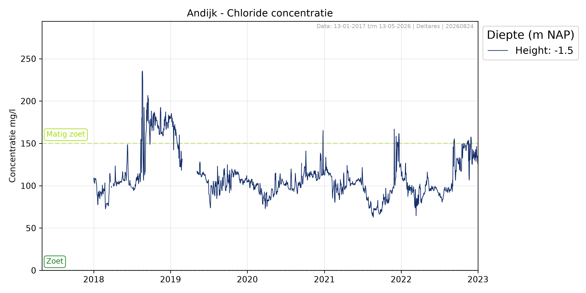
```

```{r 01-Zout-PWN, echo=FALSE, fig.cap="Chloride PWN"}
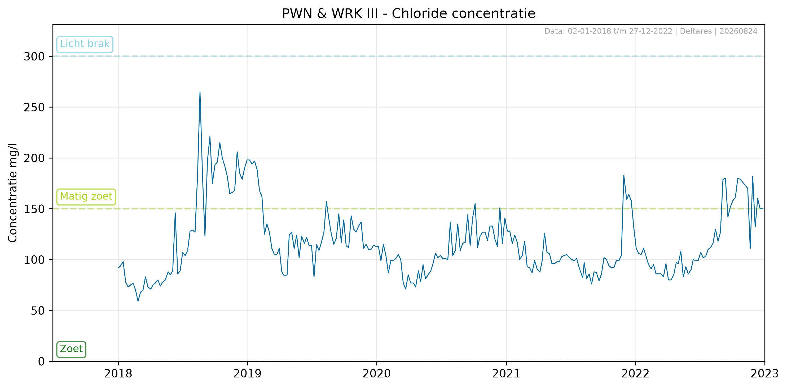
```

```{r 02-Zout-Den-oever-IJsselmeer-binnenhaven, echo=FALSE, fig.cap="Chloride Den Oever binnenhaven"}
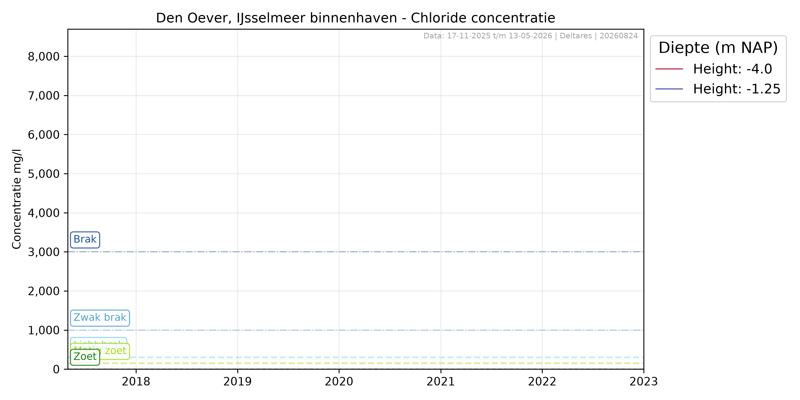
```

```{r 03-Zout-Den-oever-spuisluis-binnen, echo=FALSE, fig.cap="Chloride Den Oever spuisluis binnen"}
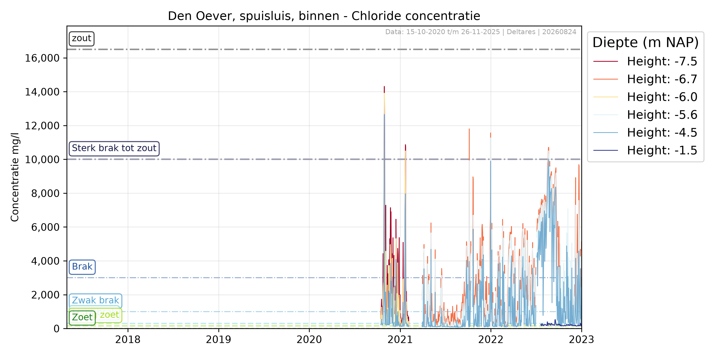
```

```{r 04-Zout-Den-oever-waddenzee, echo=FALSE, fig.cap="Chloride Den Oever voorhaven kolk"}
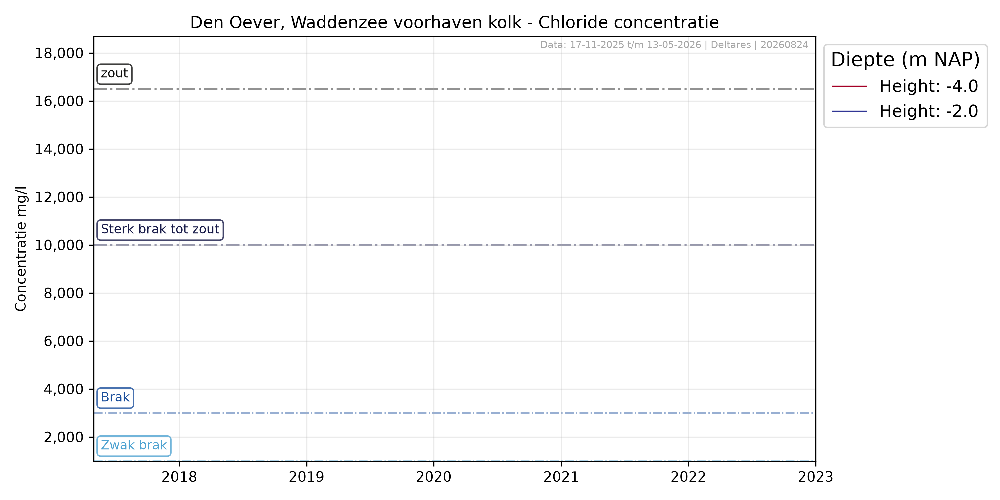
```

```{r 05-Zout-Den-oever-vaargeul, echo=FALSE, fig.cap="Chloride Den Oever Vaargeul"}
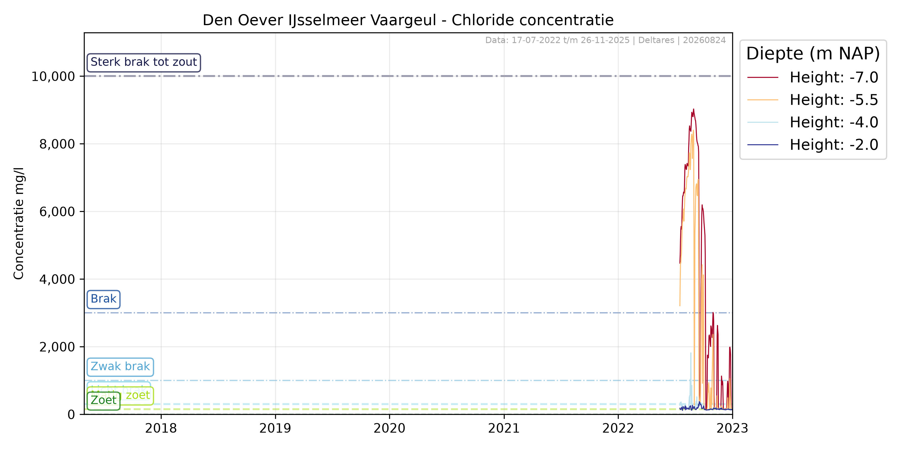
```

```{r 06-Zout-Den-oever-stevinsluizen-zuid, echo=FALSE, fig.cap="Chloride Den Oever Stevinsluizen zuid"}
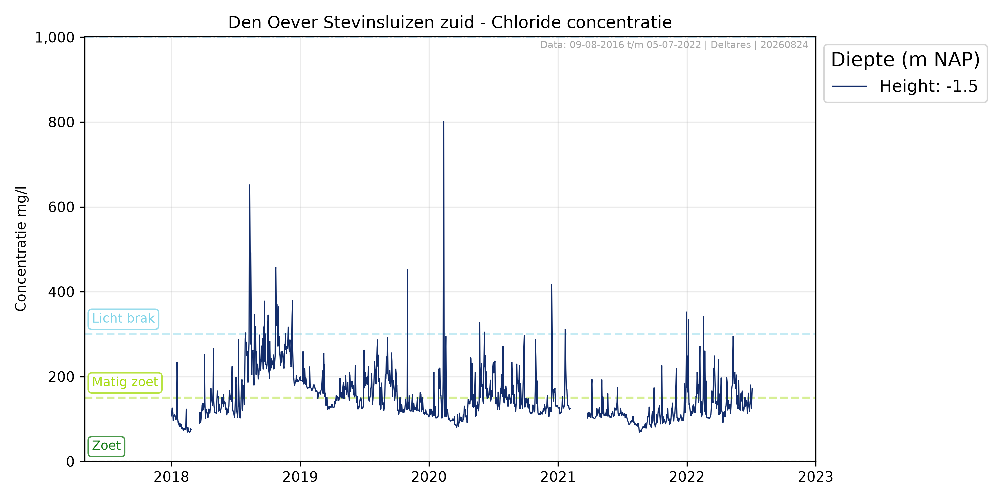
```

```{r 07-Zout-Kornwerderzand-IJsselmeer-binnenhaven, echo=FALSE, fig.cap="Chloride Kornwerderzand binnenhaven"}
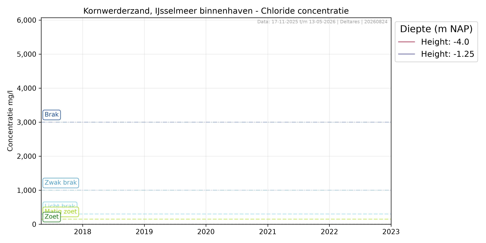
```

```{r 08-Zout-Kornwerderzand-Waddenzee, echo=FALSE, fig.cap="Chloride Kornwerderzand Waddenzee"}
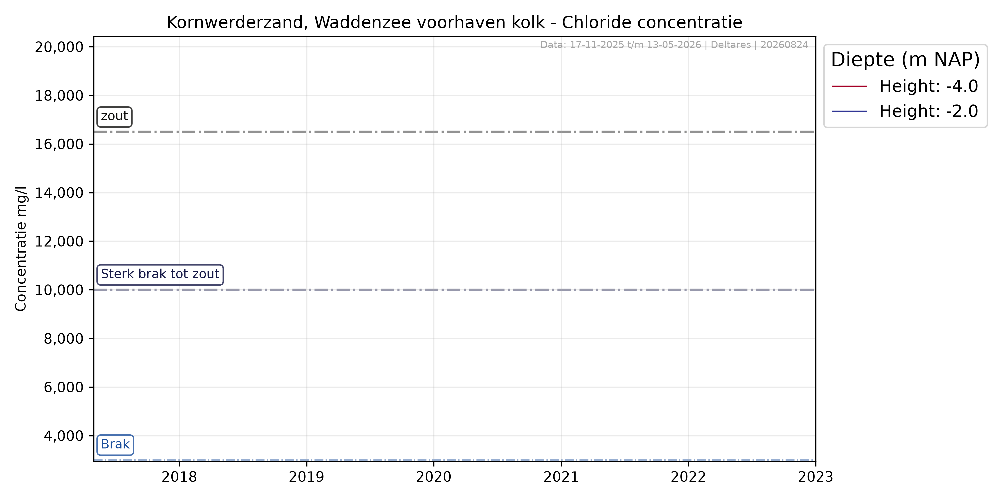
```

```{r 09-Zout-Kornwerderzand-middelgronden, echo=FALSE, fig.cap="Chloride Kornwerderzand Middelgronden"}
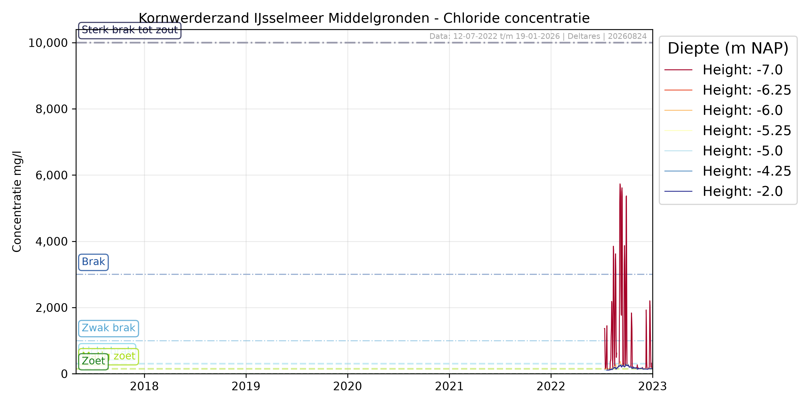
```

```{r 10-Zout-Kornwerderzand-spui, echo=FALSE, fig.cap="Chloride Kornwerderzand spui"}
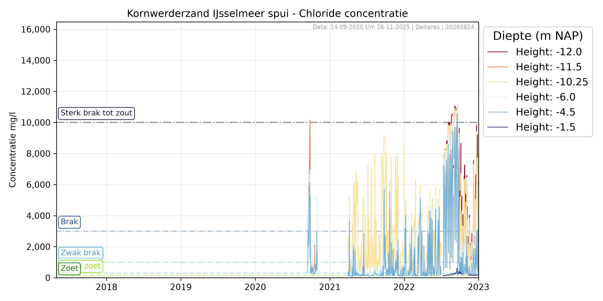
```

```{r 11-Zout-Kornwerderzand-vaargeul, echo=FALSE, fig.cap="Chloride Kornwerderzand Vaargeul"}
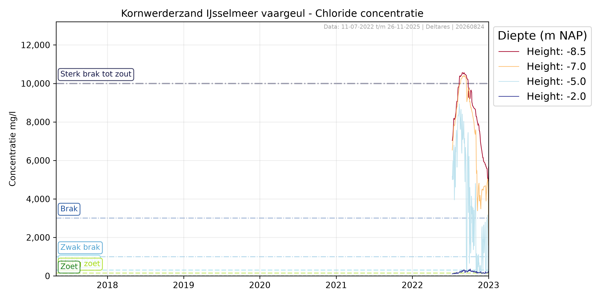
```

```{r 12-Zout-Kornwerderzand-spuihaven-zuid, echo=FALSE, fig.cap="Chloride Kornwerderzand spuihaven zuid"}
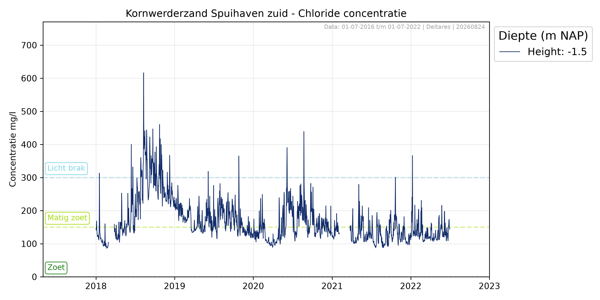
```

```{r 13-Zout-Vrouwezand, echo=FALSE, fig.cap="Chloride Vrouwezand"}
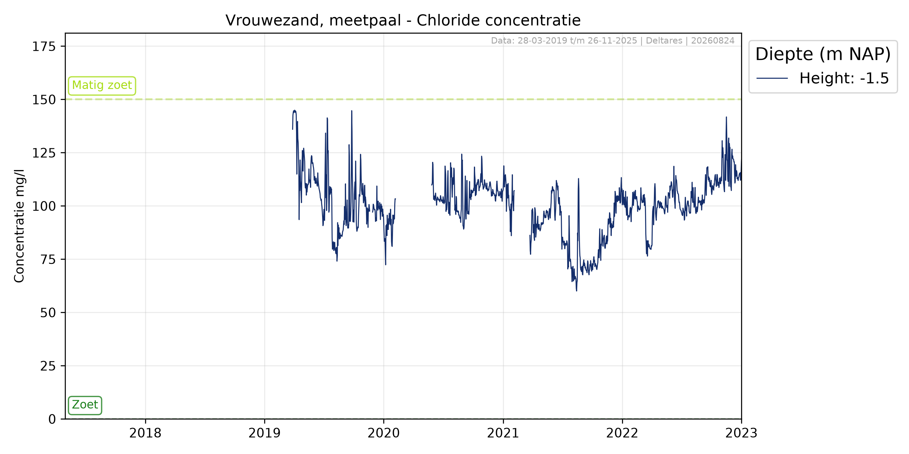
```

```{r 14-Zout-gemaal-Lely, echo=FALSE, fig.cap="Chloride gemaal Lely"}
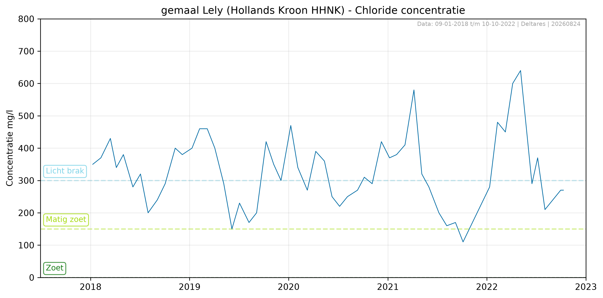
```

##### Markermeer

```{r 01-Zout-Blocq-van-Kuffeler-hoog, echo=FALSE, fig.cap="Chloride Blocq-van-Kuffeler-hoog"}
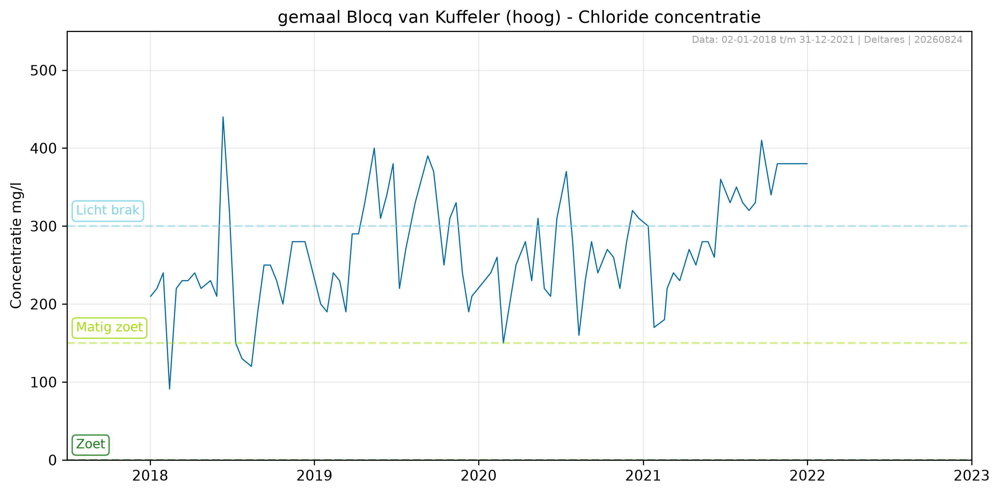
```

```{r 02-Zout-Blocq-van-Kuffeler-laag, echo=FALSE, fig.cap="Chloride Blocq-van-Kuffeler-laag"}
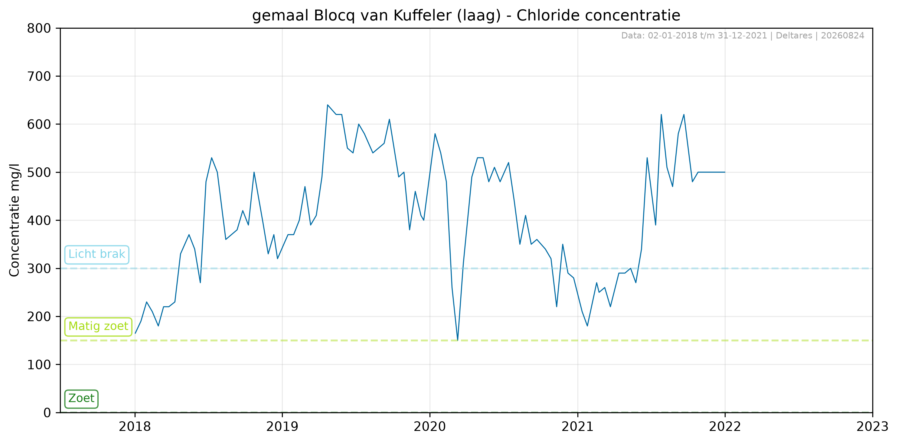
```

```{r 03-Zout-gemaal-zeeburg-aanvoer, echo=FALSE, fig.cap="Chloride gemaal-zeeburg-aanvoer"}
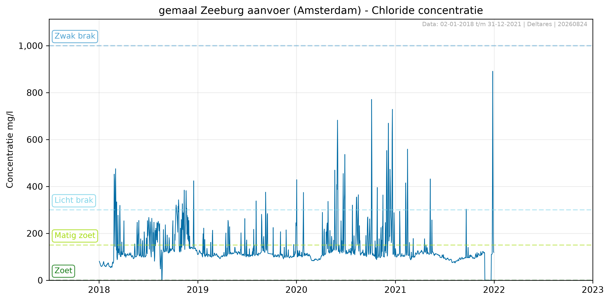
```

```{r 04-Zout-gemaal-zeeburg-afvoer, echo=FALSE, fig.cap="Chloride gemaal-zeeburg-afvoer"}
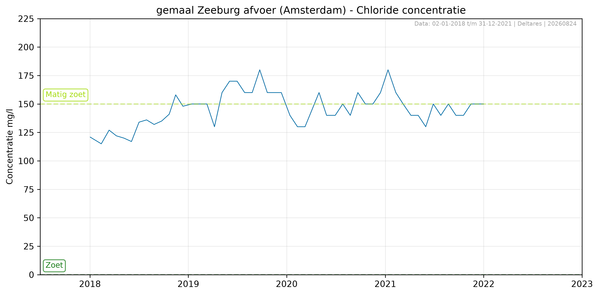
```

```{r 05-Zout-Oranjesluizen, echo=FALSE, fig.cap="Chloride Schellingwoudebrug"}
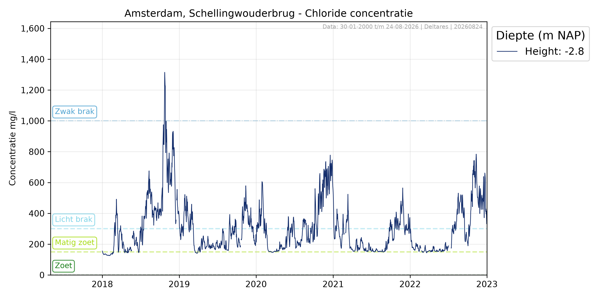
```

```{r 06-Zout-Schellingwoude, echo=FALSE, fig.cap="Chloride Oranjesluizen/Schellingerwoude"}
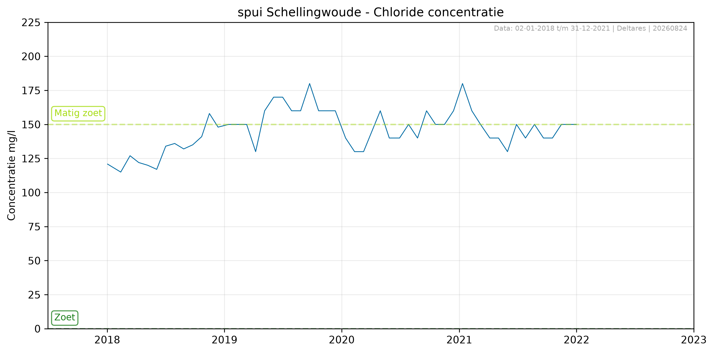
```

## Waterhoogte {#waterhoogte}

!!! DIT IS EEN TESTVERSIE !!!

De onderstaande figuren tonen de ontwikkeling van de waterstanden op verschillende meetlocaties binnen het IJsselmeergebied. De metingen geven inzicht in zowel de dagelijkse variatie als de langjarige ontwikkeling van de waterhoogte. Schommelingen in waterstanden worden beïnvloed door meteorologische omstandigheden, rivierafvoer, windopzet en het operationele waterbeheer. Door de waterstanden tussen locaties te vergelijken worden verschillen binnen het systeem zichtbaar en kunnen periodes met extreem hoge of lage waterstanden worden geïdentificeerd. De gegevens vormen daarmee een belangrijke basis voor het begrijpen van de hydrodynamiek en het waterbeheer van het IJsselmeer.

```{r waterhoogte, echo=FALSE}
# imgs <- list.files(
#   "images/waterhoogte",
#   pattern = "\\.png$",
#   full.names = TRUE
# )
# 
# knitr::include_graphics(imgs)
```

## Debiet {#debiet}

!!! DIT IS EEN TESTVERSIE !!!

De onderstaande figuren tonen de ontwikkeling van de debieten op verschillende locaties binnen het IJsselmeergebied. De tijdreeksen geven inzicht in de variatie van de aan- en afvoer van water door de tijd en laten zowel de invloed van seizoenspatronen als kortdurende hydrologische gebeurtenissen zien. Met name op locaties zoals Den Oever en Krabbersgat zijn pieken en dalen zichtbaar die samenhangen met neerslag, rivierafvoer, waterbeheer en spuibeheer. Door de ontwikkelingen op verschillende locaties te vergelijken ontstaat een beter beeld van de waterverdeling binnen het systeem en de wijze waarop het IJsselmeer reageert op veranderende hydrologische omstandigheden.

```{r debiet, echo=FALSE}
# imgs <- list.files(
#   "images/debiet",
#   pattern = "\\.png$",
#   full.names = TRUE
# )
# 
# knitr::include_graphics(imgs)
```

## Inventaristatie van gedane ingrepen (toestand objecten)
Tekst

## Beschouwing van fysische processen en effectiviteit ingrepen
Tekst

## Conclusies
Tekst

## Interactieve figuur

!!! DIT IS EEN TESTVERSIE !!!

```{r def, echo=FALSE, results='asis'}
cat(
  '<iframe
      src="images/interactive/interactive_plot_waterbalans_wind_saliniteit_20260728.html"
      width="100%"
      height="1200px"
      style="border:none;">
   </iframe>'
)
```
