\newpage

# Historische gegevens (2018-2022) {#meetdata}

```{r setupWaterkwaliteit, include = FALSE}

theme_wq = theme_bw()
```

```{r readWQData}
# ddl\standard\WQ_TS_trendstations_allyears.csv
path <- "https://watersysteemdata.deltares.nl/thredds/fileServer/watersysteemdata/Wadden/ddl/standard/WQ_TS_trendstations_allyears.csv"
# path <- file.path( datadir, "ddl", "standard/", "WQ_TS_trendstations_allyears.csv")
WQ <- read_delim(path, delim = ";", guess_max = 1000000, na = c("999999999999", "999999e32"))
ZS <- read_delim(file.path(datadir, "RWS", "standard", "ZS_all.csv"), delim = ";") %>%
  mutate(kwaliteitswaarde.code = as.character(kwaliteitswaarde.code))

WQ <- WQ %>% bind_rows(ZS)

# ddl\standard\WQ_TS_trendstations_allyears.csv
path_IJS <- "https://watersysteemdata.deltares.nl/thredds/fileServer/watersysteemdata/IJsselmeer/locaties_debiet.csv"
# path <- file.path( datadir, "ddl", "standard/", "WQ_TS_trendstations_allyears.csv")
WQ_IJS <- read_delim(path_IJS, delim = ";", guess_max = 1000000, na = c("999999999999", "999999e32"))

```

## Water {#water}

figuur \@ref(fig:kaartDDLlocaties)

```{r kaartDDLlocaties, cache=F, fig.cap = "Huidige locaties met metingen ."}

plotlocaties = c("Vliestroom", "Marsdiep noord", "Doove Balg west", "Dantziggat", "Boomkensdiep", "Terschelling 10 km uit de kust","Rottumerplaat 3 km uit de kust", "Huibertgat oost", "Bocht van Watum", "Groote Gat noord")

WQlocations <- WQ %>%
  distinct(locatie.code, locatie.naam, geometriepunt.x, geometriepunt.y, grootheid.code, parameter.code) %>% st_as_sf(coords = c("geometriepunt.x", "geometriepunt.y"), crs = 4326) %>%
  filter(locatie.naam %in% plotlocaties)
# 
# leaflet::leaflet(WQlocations) %>%
#   leaflet::addTiles(group = "OSM") %>%
#   # addProviderTiles(providers$Esri.WorldTopoMap, group = "Esri.WorldTopoMap") %>%
#   # addProviderTiles(providers$Esri.WorldImagery, group = "Esri.WorldImagery") %>%
#   # leaflet::addProviderTiles("OpenSeaMap", group = "OpenSeaMap") %>%
#   leaflet::addCircleMarkers(label = ~htmltools::htmlEscape(paste0(locatie.naam)), group = "all_locations", radius = 4, labelOptions = labelOptions(noHide = T, direction = 30)) #%>%
#   # leaflet::addLayersControl(
#   #   baseGroups = c("OSM",  "Esri.WorldTopoMap", "Esri.WorldImagery"),
#   #   overlayGroups = c("all_locations", "watersysteem", "OpenSeaMap")) %>%    #, "KRW waterlichamen 2006"
#   # hideGroup("KRW waterlichamen 2006")


WQlocations_IJS <- WQ_IJS %>%
  distinct(naam, X, Y,) %>% st_as_sf(coords = c("X", "Y"), crs = 4326)

leaflet::leaflet(WQlocations_IJS) %>%
  leaflet::addProviderTiles(
  providers$Esri.WorldGrayCanvas,
  group = "Basemap"
  ) %>%
  # addProviderTiles(providers$Esri.WorldTopoMap, group = "Esri.WorldTopoMap") %>%
  # addProviderTiles(providers$Esri.WorldImagery, group = "Esri.WorldImagery") %>%
  # leaflet::addProviderTiles("OpenSeaMap", group = "OpenSeaMap") %>%
  leaflet::addCircleMarkers(label = ~htmltools::htmlEscape(paste0(naam)), group = "all_locations", radius = 4, labelOptions = labelOptions(noHide = T, direction = 30)) #%>%
  # leaflet::addLayersControl(
  #   baseGroups = c("OSM",  "Esri.WorldTopoMap", "Esri.WorldImagery"),
  #   overlayGroups = c("all_locations", "watersysteem", "OpenSeaMap")) %>%    #, "KRW waterlichamen 2006"
  # hideGroup("KRW waterlichamen 2006")

```

```{r 01-Debiet-IJssel, echo=FALSE, fig.cap="debiet IJssel gemeten bij Olst"}
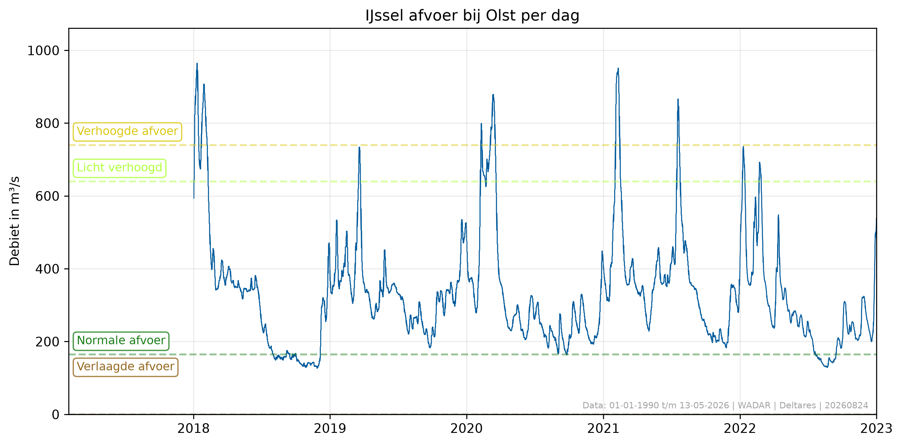
```

```{r 02-Debiet-Lorentzsluizen, echo=FALSE, fig.cap="debiet Lorentz spuisluizen"}
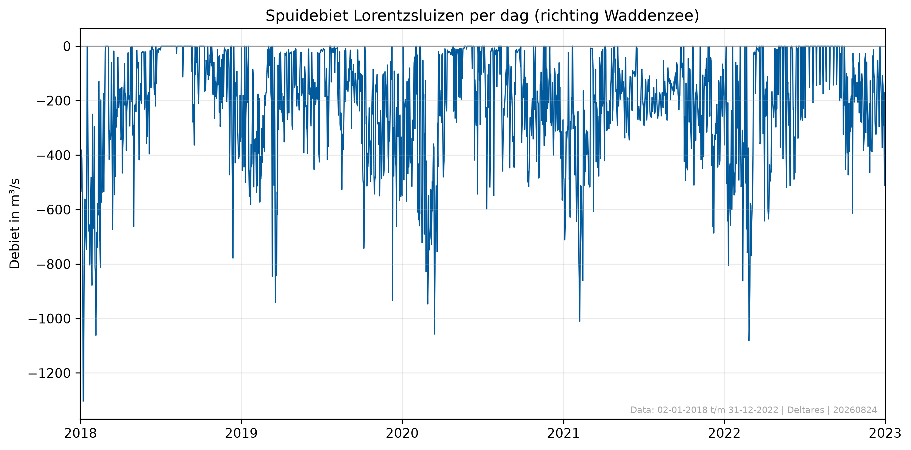
```

```{r 03-Debiet-Stevinssluizen, echo=FALSE, fig.cap="debiet Stevin spuisluizen"}
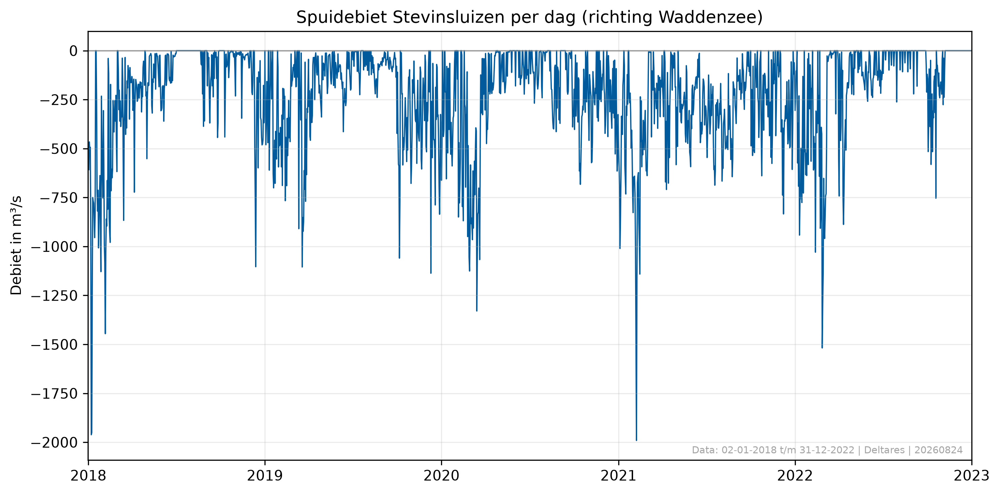
```

```{r 04-Debiet-Houtribsluis, echo=FALSE, fig.cap="debiet Houtribsluis noord"}
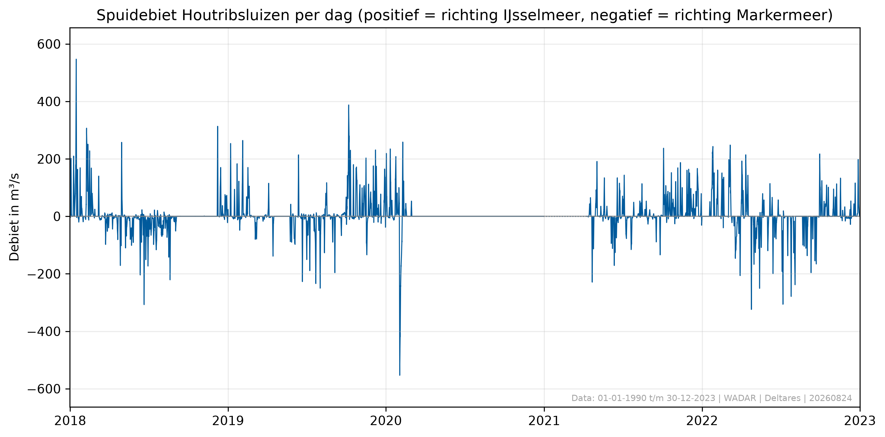
```

```{r 05-Debiet-Krabbersgatsluizen, echo=FALSE, fig.cap="debiet Krabbersgat"}
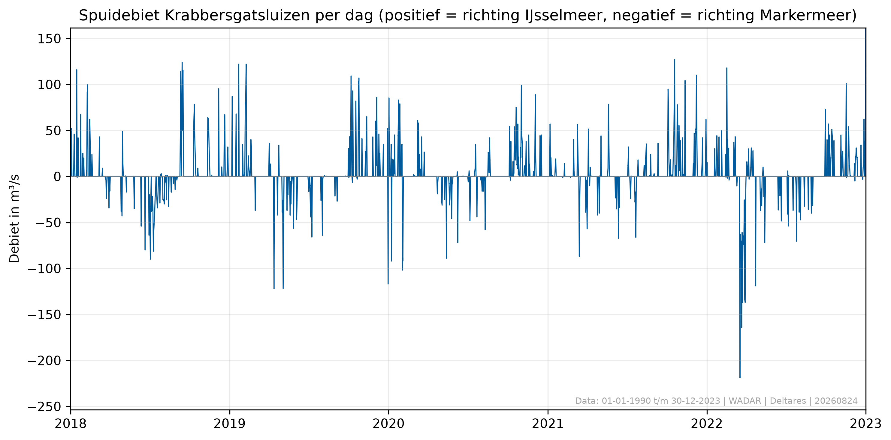
```

```{r 06-Debiet-overig, echo=FALSE, fig.cap="debiet overige locaties"}
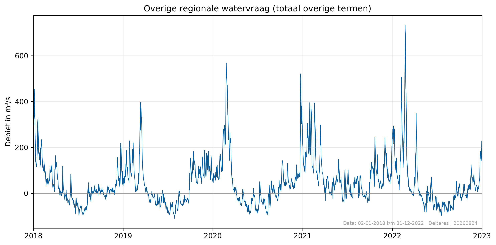
```

```{r 01-Berging-IJsselmeer, echo=FALSE, fig.cap="Berging IJsselmeer"}
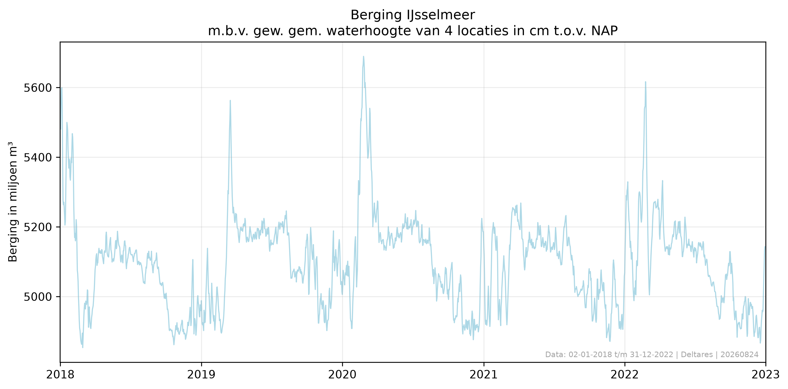
```

```{r 01-Neerslag, echo=FALSE, fig.cap="Neerslag op dagbasis IJsselmeer"}
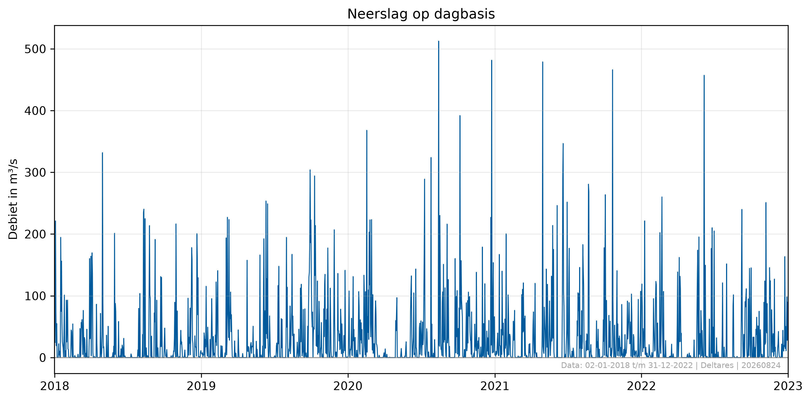
```

```{r 02-Verdamping, echo=FALSE, fig.cap="Verdamping op dagbasis IJsselmeer"}
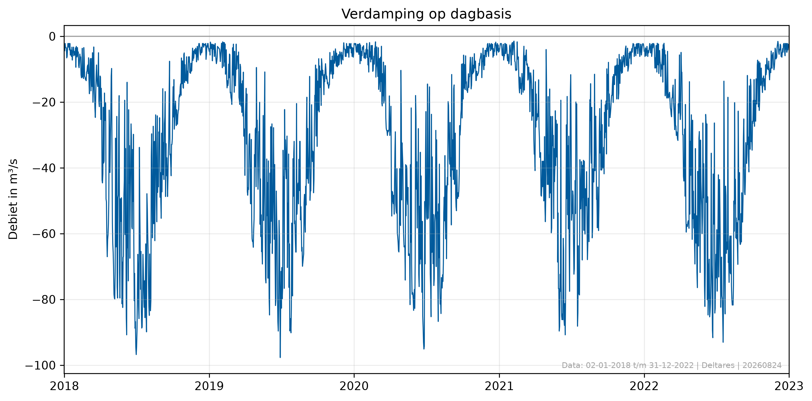
```

```{r 01-waterbalans-abs, echo=FALSE, fig.cap="Maandelijkse in- en uitstroom absoluut"}
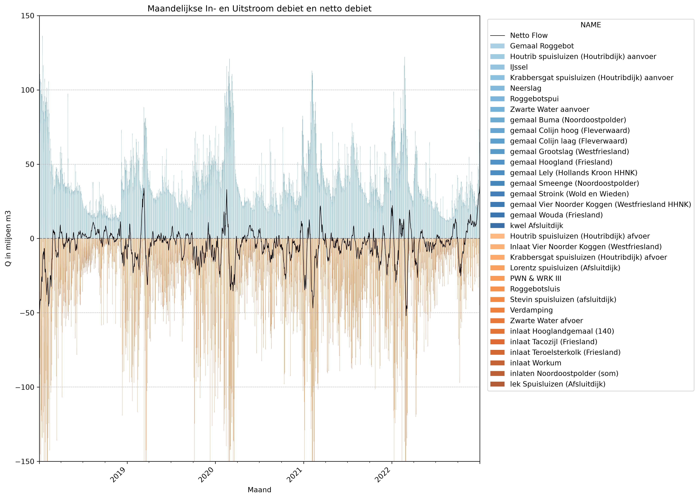
```

```{r 02-waterbalans-rel, echo=FALSE, fig.cap="Maandelijkse in- en uitstroom relatief"}
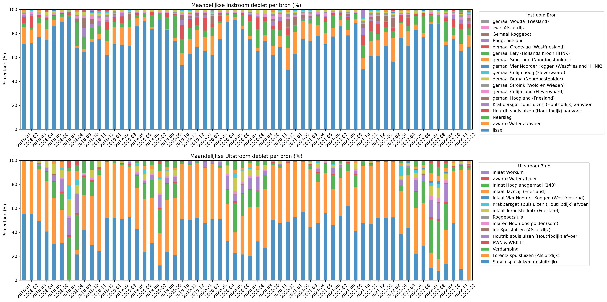
```

## Wind {#wind}

De onderstaande figuren tonen de ontwikkeling van windsnelheid en windrichting op meetlocaties in en rond het IJsselmeergebied. Wind is een belangrijke sturende factor binnen het watersysteem en heeft invloed op onder andere waterstanden, golfopbouw, menging van de waterkolom en de verspreiding van stoffen. De tijdreeksen laten zowel seizoensgebonden patronen als kortdurende stormachtige gebeurtenissen zien. Door de ontwikkelingen door de tijd te volgen en verschillende locaties met elkaar te vergelijken, ontstaat inzicht in de ruimtelijke en temporele variatie van de windcondities en hun mogelijke invloed op het functioneren van het watersysteem.

```{r interactive-wind, echo=FALSE, results='asis'}
cat(
  '<iframe
      src="images/wind/wind_speed_direction_Stavoren_IJsselmeer.html"
      width="100%"
      height="650px"
      style="border:none;">
   </iframe>'
)
```


```{r wind, echo=FALSE}
# imgs <- list.files(
#   "images/wind",
#   pattern = "\\.png$",
#   full.names = TRUE
# )
# 
# knitr::include_graphics(imgs)
```


## Zout {#zout}

```{r jaargemiddeldeSal, fig.height=20, fig.width=10, fig.cap="Jaargemiddelde saliniteit in de Waddenzee. Maandgemiddelden (punten) en individuele metingen (kleinste punten) geven het bereik aan. Jaargemiddelde is alleen berekend bij meer dan 10 metingen per jaar. "}
# 
# 
# plotlocaties = c("Vliestroom", "Marsdiep noord", "Doove Balg west", "Dantziggat", "Boomkensdiep", "Terschelling 10 km uit de kust","Rottumerplaat 3 km uit de kust", "Huibertgat oost", "Bocht van Watum", "Groote Gat noord")
# 
# par = "NVT"
# gro = "SALNTT"
# parlabel = "saliniteit in PSU"
# xlabel = "jaar"
# 
# parData <- WQ %>% 
#   filter(parameter.code == par, grootheid.code == gro, as.numeric(kwaliteitswaarde.code) < 50) %>%
#   filter(locatie.naam %in% plotlocaties) %>%
#   arrange(geometriepunt.x) %>%
#   mutate(jaar = year(tijdstip), maand = month(tijdstip)) %>%
#   mutate(locatie.naam = factor(locatie.naam, levels = plotlocaties))
# 
#   ggplot() +
#     geom_point(data = parData, aes(as.Date(tijdstip), numeriekewaarde, color = "individuele metingen"), alpha = 1, size = 0.65) +
#     geom_point(data = parData %>%
#                  group_by(locatie.naam, jaar, maand) %>% summarize(maandgemiddelde = mean(numeriekewaarde), n = n()),
#                aes(as.Date(lubridate::ymd(paste(jaar, maand, "15"))), maandgemiddelde, color = "maandgemiddelde"), size = 1
#     ) +
#     geom_line(data = parData %>%
#                 group_by(locatie.naam, jaar, maand) %>% summarize(maandgemiddelde = mean(numeriekewaarde), n = n()) %>% ungroup() %>%
#                 group_by(locatie.naam, jaar) %>% summarize(jaargemiddelde = mean(maandgemiddelde), `n/jaar` = sum(n)) %>% ungroup() %>%
#                 filter(`n/jaar` > 10),
#               aes(as.Date(lubridate::ymd(paste(jaar, "07", "01"))), jaargemiddelde, color = "jaargemiddelde"), size = 1.5, alpha = 0.8
#     ) +
#     coord_cartesian(ylim = c(5,NA)) +
#     ylab(parlabel) + xlab(xlabel) +
#     facet_wrap(~ locatie.naam, ncol = 1) +  #scales = "free",
#     theme_wq +
#     theme(legend.position = "bottom") +
#     scale_colour_manual(name = "",
#                         values = c("maandgemiddelde" = "black", 
#                                    "jaargemiddelde" = "red",
#                                    "metingen" = "darkgrey")) +
#     guides(colour = guide_legend(override.aes = list(shape = 1, size = 3)))
# 
```

```{r plotSaliniteitAnomalie, fig.margin=TRUE, fig.height = 20, fig.width = 10, fig.cap="Anomalie (afwijking van het langjarig gemiddelde) van saliniteit voor de gehele meetperiode"}
# 
# plotlocaties = c("Vliestroom", "Marsdiep noord", "Doove Balg west", "Dantziggat", "Boomkensdiep", "Terschelling 10 km uit de kust","Rottumerplaat 3 km uit de kust", "Huibertgat oost", "Bocht van Watum", "Groote Gat noord")
# 
# par = "NVT"
# grp = "SALNTT"
# parlabel = "anomalie salinteit"
# jet.colors <- colorRampPalette(c("#00007F", "blue", "#007FFF", "cyan", "#7FFF7F", "yellow", "#FF7F00", "red", "#7F0000"))
# my_breaks = c(5, 10, 15, 20, 25, 30)
# k = 13
# 
# WQ %>%
#   dplyr::select(tijdstip, locatie.naam, grootheid.code, parameter.code, eenheid.code, geometriepunt.x, geometriepunt.y, coordinatenstelsel, bemonsteringshoogte, referentievlak, kwaliteitswaarde.code, numeriekewaarde) %>%
#   dplyr::filter(parameter.code == par, grootheid.code == gro, as.numeric(kwaliteitswaarde.code) < 50, year(tijdstip) >= 1989) %>%
#   dplyr::filter(locatie.naam %in% plotlocaties) %>%
#   dplyr::mutate(jaar = year(tijdstip), maand = month(tijdstip)) %>%
#   # mutate(logwaarde = log(numeriekewaarde)+0.001) %>%
#   dplyr::group_by(locatie.naam, jaar, maand) %>% dplyr::summarize(maandgemiddelde = mean(numeriekewaarde)) %>% ungroup() %>%
#   dplyr::group_by(locatie.naam) %>% dplyr::mutate(anomalie = maandgemiddelde - mean(maandgemiddelde)) %>% ungroup() %>% 
#   tidyr::complete(locatie.naam, jaar, maand, fill = list(maandgemiddelde = NA, anomalie = NA)) %>% 
#   mutate(datum = as.Date(lubridate::ymd(paste(jaar, maand, "15")))) %>%
#   arrange(locatie.naam, datum) %>%
#   # mutate(anomalie = oce::fillGap(anomalie)) %>%
#   group_by(locatie.naam) %>% mutate(rM=rollmean(anomalie,k, na.pad=TRUE, align="center", na.rm = T)) %>%
#   mutate(locatie.naam = factor(locatie.naam, levels = plotlocaties)) %>% 
#   ggplot(aes(datum, anomalie)) + 
#   geom_point(aes(color = maandgemiddelde), alpha = 0.4) +   #size = `n/jaar`
#   geom_line(aes(y=rM), size = 1, color = "blue")  +
#   coord_cartesian(ylim = c(-5,5)) +
#   ylab(parlabel) +
#   facet_wrap(~ locatie.naam, ncol = 1) +  #scales = "free",
#   scale_color_gradientn(colours = jet.colors(7), name = "maandgemiddelde saliniteit in mg/l",
#                         trans = "log", breaks = my_breaks, labels = my_breaks) +
#   # scale_color_viridis_c(values = rescale(0:300)) +
#   # guides(colour = guide_legend("maandgemiddeld ZS")) +
#   theme_wq +
#   theme(legend.position = "bottom", legend.key.width = unit(2.5, "cm"))
# 
```

De onderstaande figuren tonen de ontwikkeling van diverse hydrologische en waterkwaliteitsparameters op meerdere meetlocaties binnen het IJsselmeergebied. De tijdreeksen geven inzicht in zowel langjarige trends als kortdurende fluctuaties, waardoor veranderingen in de toestand van het watersysteem door de tijd gevolgd kunnen worden. De weergegeven locaties omvatten onder andere belangrijke in- en uitstroompunten zoals Den Oever en Krabbersgat, evenals verschillende meetstations verspreid over het IJsselmeer. Voor meerdere parameters zijn duidelijke seizoenspatronen zichtbaar, terwijl andere reeksen juist worden gekenmerkt door incidentele pieken die samenhangen met hydrologische gebeurtenissen, weersomstandigheden of waterbeheermaatregelen. Door de ontwikkeling van de metingen tussen locaties te vergelijken, worden ruimtelijke verschillen binnen het systeem inzichtelijk en kunnen trends, afwijkingen en bijzondere gebeurtenissen beter worden geduid. De figuren bieden daarmee een waardevolle basis voor het beoordelen van de dynamiek en ontwikkeling van het IJsselmeerwatersysteem.


```{r zoutbalans, echo=FALSE}
#  imgs <- list.files(
#    "images/saliniteit",
#    pattern = "\\.png$",
#    full.names = TRUE
# )
# 
# knitr::include_graphics(imgs)
```

### IJsselmeer

```{r 01-Zout-Andijk, echo=FALSE, fig.cap="Chloride Andijk"}
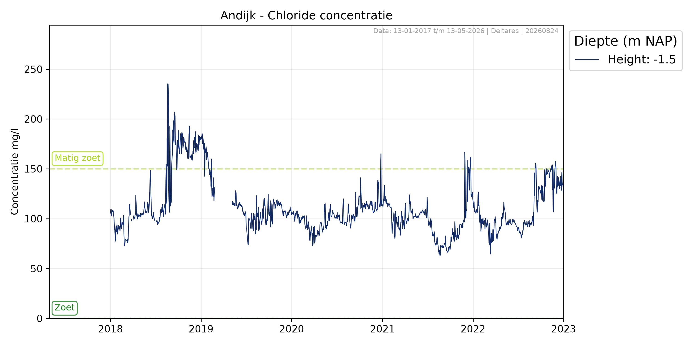
```

```{r 01-Zout-PWN, echo=FALSE, fig.cap="Chloride PWN"}
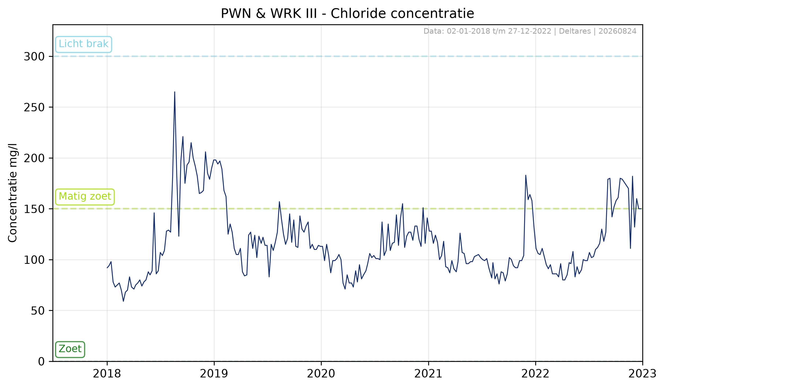
```

```{r 02-Zout-Den-oever-IJsselmeer-binnenhaven, echo=FALSE, fig.cap="Chloride Den Oever binnenhaven"}
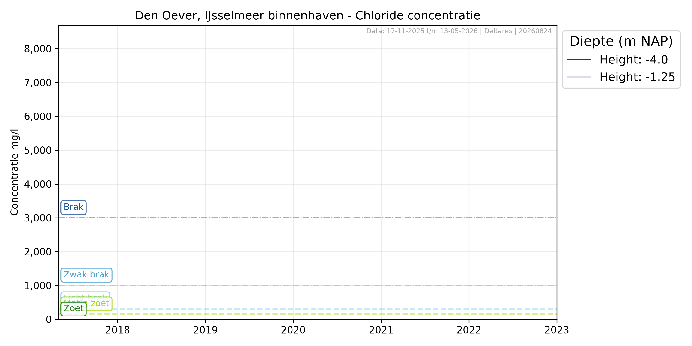
```

```{r 03-Zout-Den-oever-spuisluis-binnen, echo=FALSE, fig.cap="Chloride Den Oever spuisluis binnen"}
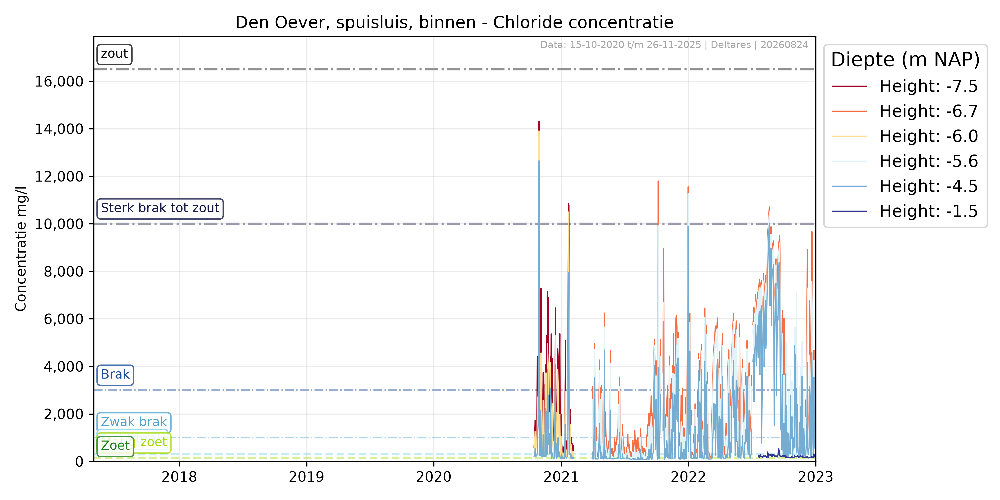
```

```{r 04-Zout-Den-oever-waddenzee, echo=FALSE, fig.cap="Chloride Den Oever voorhaven kolk"}
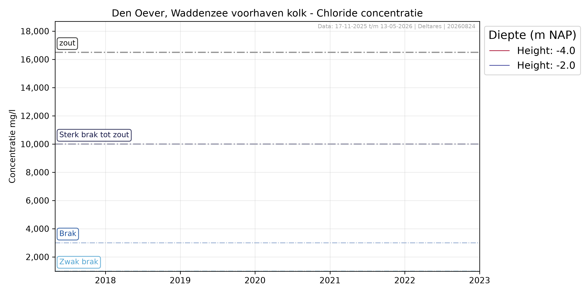
```

```{r 05-Zout-Den-oever-vaargeul, echo=FALSE, fig.cap="Chloride Den Oever Vaargeul"}
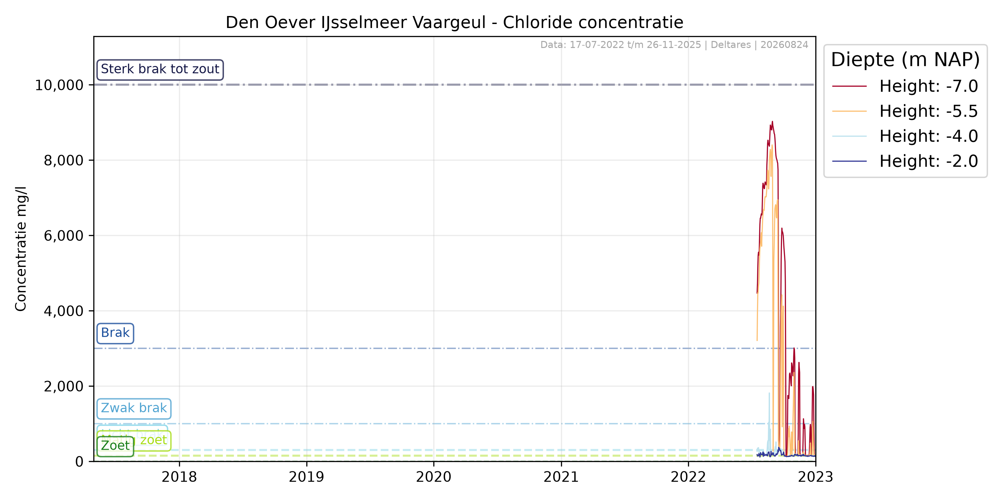
```

```{r 06-Zout-Den-oever-stevinsluizen-zuid, echo=FALSE, fig.cap="Chloride Den Oever Stevinsluizen zuid"}
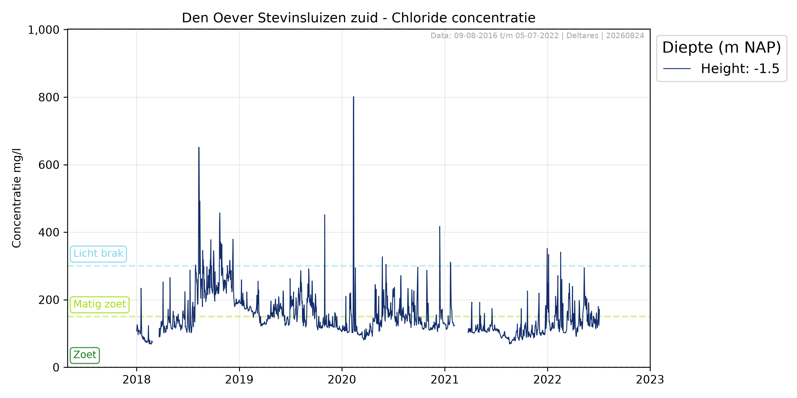
```

```{r 07-Zout-Kornwerderzand-IJsselmeer-binnenhaven, echo=FALSE, fig.cap="Chloride Kornwerderzand binnenhaven"}
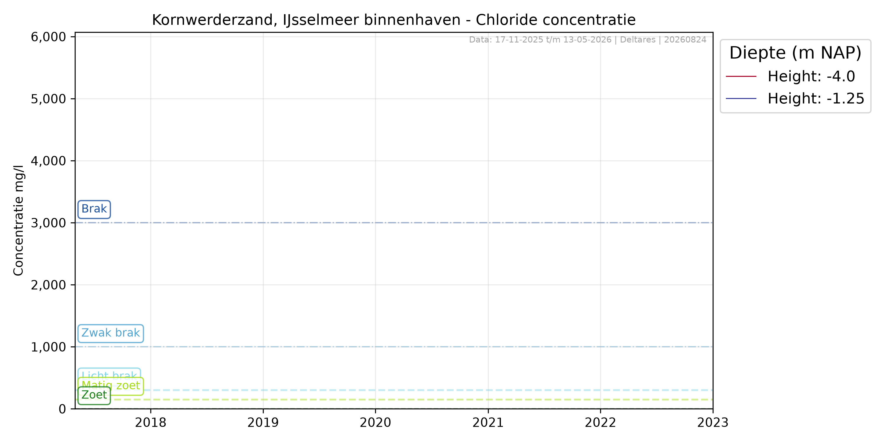
```

```{r 08-Zout-Kornwerderzand-Waddenzee, echo=FALSE, fig.cap="Chloride Kornwerderzand Waddenzee"}
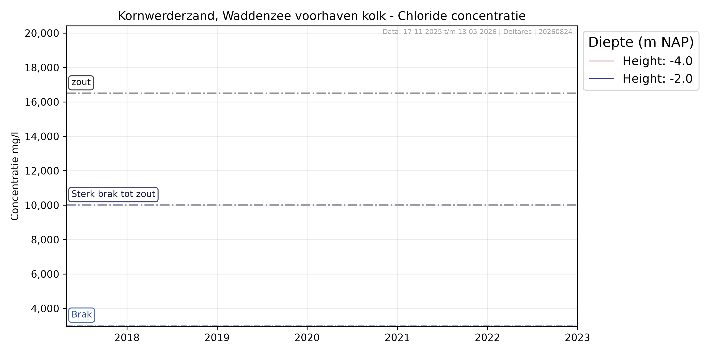
```

```{r 09-Zout-Kornwerderzand-middelgronden, echo=FALSE, fig.cap="Chloride Kornwerderzand Middelgronden"}
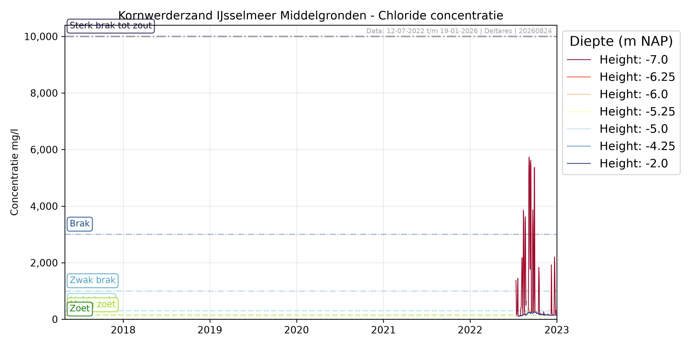
```

```{r 10-Zout-Kornwerderzand-spui, echo=FALSE, fig.cap="Chloride Kornwerderzand spui"}
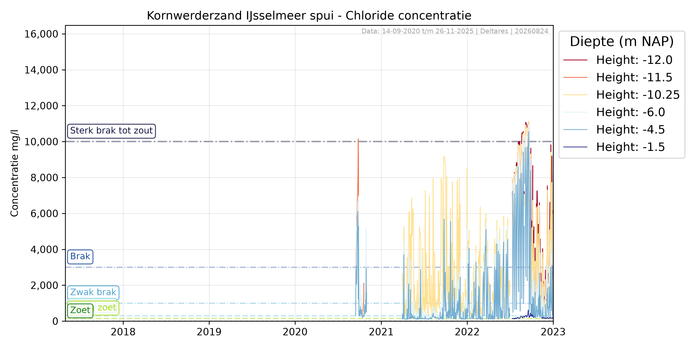
```

```{r 11-Zout-Kornwerderzand-vaargeul, echo=FALSE, fig.cap="Chloride Kornwerderzand Vaargeul"}
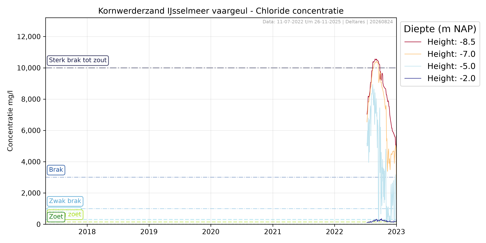
```

```{r 12-Zout-Kornwerderzand-spuihaven-zuid, echo=FALSE, fig.cap="Chloride Kornwerderzand spuihaven zuid"}
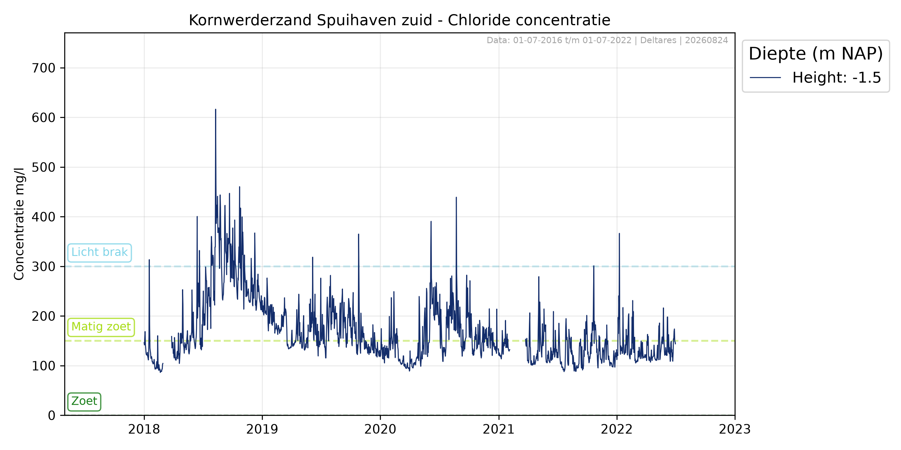
```

```{r 13-Zout-Vrouwezand, echo=FALSE, fig.cap="Chloride Vrouwezand"}
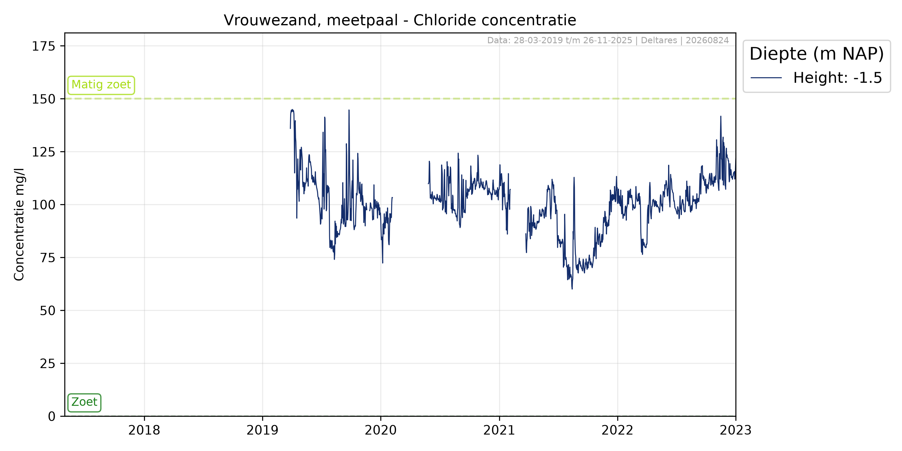
```

```{r 14-Zout-gemaal-Lely, echo=FALSE, fig.cap="Chloride gemaal Lely"}
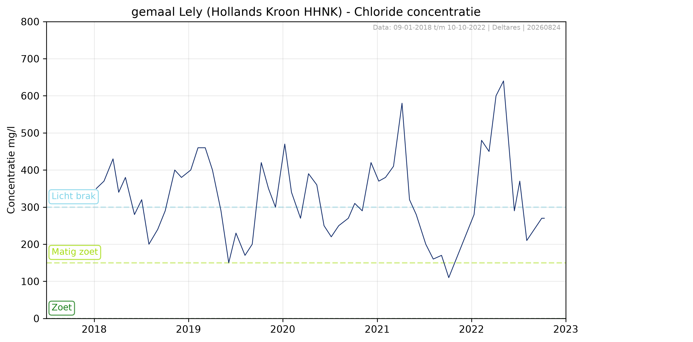
```

### Markermeer

```{r 01-Zout-Blocq-van-Kuffeler-hoog, echo=FALSE, fig.cap="Chloride Blocq-van-Kuffeler-hoog"}
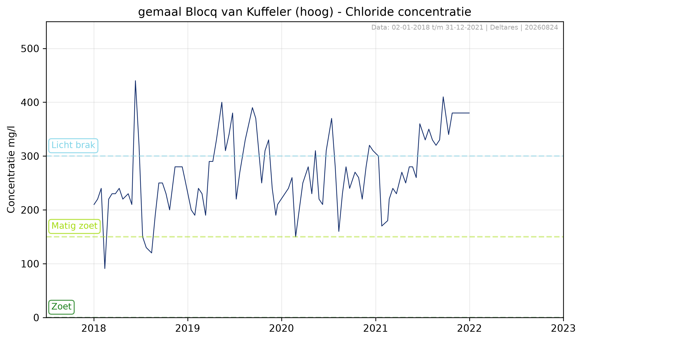
```

```{r 02-Zout-Blocq-van-Kuffeler-laag, echo=FALSE, fig.cap="Chloride Blocq-van-Kuffeler-laag"}
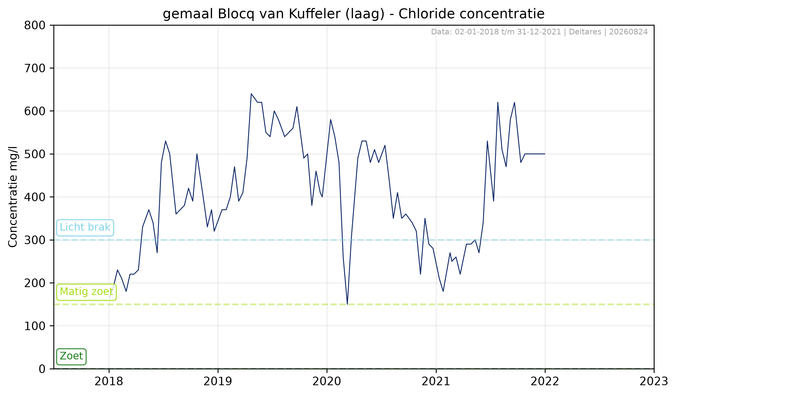
```

```{r 03-Zout-gemaal-zeeburg-aanvoer, echo=FALSE, fig.cap="Chloride gemaal-zeeburg-aanvoer"}
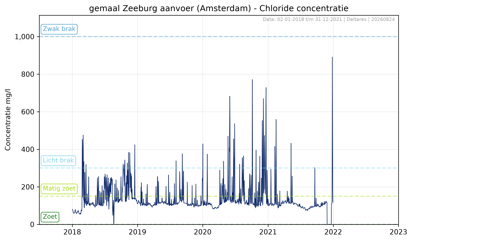
```

```{r 04-Zout-gemaal-zeeburg-afvoer, echo=FALSE, fig.cap="Chloride gemaal-zeeburg-afvoer"}
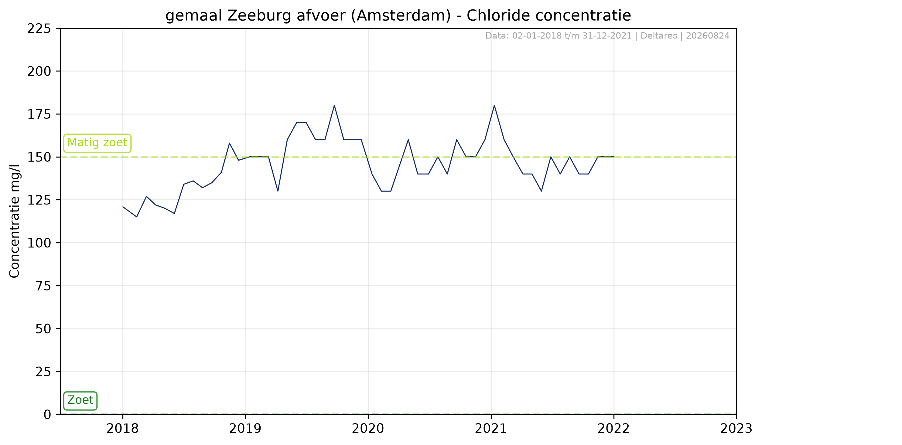
```

```{r 05-Zout-Oranjesluizen, echo=FALSE, fig.cap="Chloride Schellingwoudebrug"}
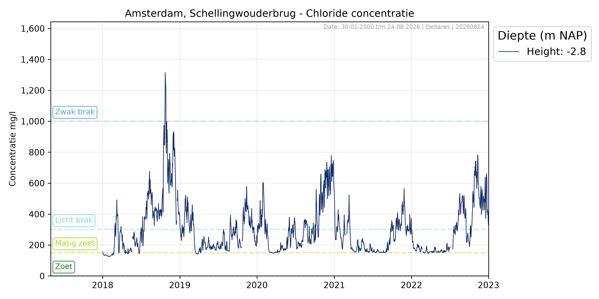
```

```{r 06-Zout-Schellingwoude, echo=FALSE, fig.cap="Chloride Oranjesluizen/Schellingerwoude"}
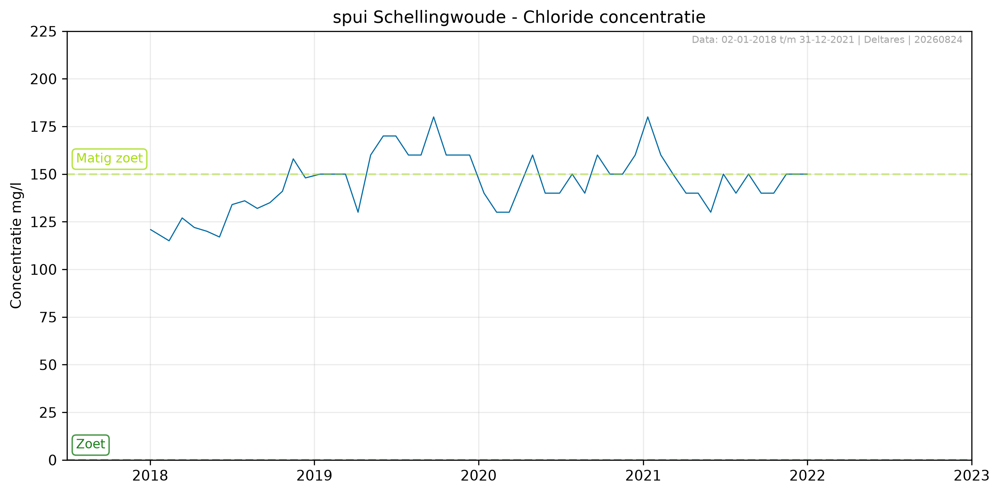
```

## Inventaristatie van gedane ingrepen (toestand objecten)
Om een relatie te kunnen leggen tussen optredende condities, genomen maatregelen, en het effect daarvan op het zoutgehalte en zoutverspreiding in het IJsselmeer is het de bedoeling voor specifieke jaren te bekijken welke maatregelen wanneer zijn genomen en waarom. Daarna kan worden bekeken hoe het zoutgehalte zich ontwikkelde. Tot slot kan een relatie worden gezocht tussen opgetreden condities (afvoer, bijvoorbeeld), genomen maatregelen, en mogelijke effecten van de genomen maatregelen. 

Voor de beschouwde periode ligt de prioriteit op de droge zomer van 2018 en die van 2022. In de toekomst kunnen hieraan andere periodes worden toegevoegd, zoals andere verziltingsgebeurtenissen (bijvoorbeeld als gevolg van de stroomstoring maart 2026, Deltares (2026a)) of bijvoorbeeld momenten met harde wind om het effect van wind gedreven menging en stroming op zout in het IJsselmeer te duiden.

Hieronder wordt eerst een overzicht gegeven van de genomen maatregelen. De opgetreden condities en mogelijke consequenties van de genomen maatregelen zullen aansluitend worden beschouwd.

### Zomer 2018
Tijdens de zomer van 2018 was sprake van lage afvoercondities die gepaard gingen met een toenemende mate van verzilting van het IJsselmeer. Om de verzilting tegen te gaan zijn de volgende maatregelen genomen:

```{r maatregelen2018, echo=FALSE, fig.cap="Genomen maatregelen tijdens de droogteperiode in 2018."}
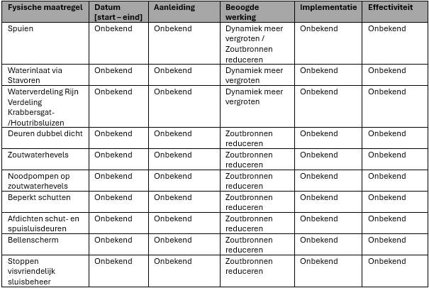
```

De beschikbare data bevatten helaas geen informatie over wanneer (start- en einddatum) de maatregel is ingezet. Ook is onbekend waarom deze maatregelen op dat moment zijn toegepast, en hoe deze zijn geïmplementeerd. De effectiviteit van de genomen maatregelen is daarom slechts beperkt gekwantificeerd.

### Zomer 2022
In de zomer van 2022 was ook sprake van lage afvoercondities. Voor deze periode is echter onbekend welke maatregelen zijn genomen.

## Beschouwing van fysische processen en effectiviteit ingrepen
### Zomer 2018
Door het ontbreken van gegevens van de daadwerkelijke toepassing van maatregelen kan hieronder geen directe relatie worden gelegd tussen opgelegde maatregelen en opgetreden zoutgehaltes. De effectiviteit van maatregelen en een beschouwing van de fysische processen die optraden in 2018 staat echter uitgebreid beschreven in een evaluatiedocument van Rijkswaterstaat dat is opgesteld naar aanleiding van de droge zomer 2018 (Rijkswaterstaat, 2020). Daarin wordt niet direct een relatie gelegd tussen opgetreden condities, de inzet van maatregelen en het effect van beide op het zoutgehalte in het meer, maar worden alleen algemene relaties uitgewerkt. Hieronder wordt daar een samenvatting van gegeven.

**Zoutoplading en verspreiding zonder maatregelen:**
Uit analyse van de meetdata van 2018 blijkt dat eerst de erosiekuilen achter de spuisluizen en in de nabijheid van de schutsluizen opvullen met zout. Deze fungeren als zoutvang waar het zoute water zich ophoopt. Daarbij ontstaat een sterke gelaagdheid tussen het zoute water in de diepe delen (tot 14.000 mg/l Chloride) en het zoete water boven de kuilrand (200 mg/l Chloride). Als de kuilen helemaal vol zijn, stromen ze over. Het vollopen van de erosiekuilen kan, afhankelijk van de mate van lekkage, maximaal 3 tot 6 dagen (bij Den Oever en Kornwerderzand, respectievelijk) duren, maar ook minder dan een dag (als de lekkage erg groot is). Er ontstaat als de erosiekuil overloopt een zouttong (van ongeveer 1 m dikte) nabij de bodem die over de drempel van de kuil stroomt naar een volgend laaggelegen gebied, bijvoorbeeld de voormalige getijdegeul, de Middelgronden en vaargeulen. Daar hoopt het zich vervolgens verder op (tot 8000 mg/l Chloride). Als het zoute water ver genoeg het meer indringt via de diepere delen,  treedt onder invloed van onder andere wind vervolgens menging op van het dieper gelegen zoute water met het hoger gelegen zoet(ere) water en (horizontale) verspreiding in de rest van het meer. In deze situatie is de verdere verspreiding van zout water in het meer niet meer effectief te bestrijden, en kan alleen ontzilting plaatsvinden door het meer te verversen met zoet water. Dit is een traag proces wat in 2018-2019 ongeveer 3 maanden heeft geduurd.

**Effectiviteit van spuien:**
Door experimenten uitgevoerd in 2019 en gegevens van de zomer van 2018 blijkt dat spuien zeer effectief is om de erosiekuilen bij Den Oever en Kornwerderzand te verzoeten. Dit geldt ook voor de Middelgronden mits er voldoende stroomsnelheid wordt gerealiseerd. Bij een normale spuigang (waarbij 3 spuikokers uit elke groep volledig open gaan) is sprake van voldoende stroomsnelheid. Bij normale spuigang kunnen de erosiekuilen zeer snel worden zoetgespoeld (soms zelfs binnen een uur). De effectiviteit van spuien op het ontzilten van verder gelegen (diepe) delen van het meer is beperkt en mede afhankelijk van de transportpaden over het meer en lokale stroomsnelheid in het verzilte gebied. 

Alhoewel spuien effectief is om verzilting tegen te gaan, gaat het hier om grote hoeveelheden water: Bij Kornwerderzand is dit gemiddeld tussen 10 miljoen en 20 miljoen m<sup>3</sup>, wat overeenkomt met een peilverlaging van bijna 14 mm. Dit spuivolume is 75 keer groter dan het volume van de erosiekuil van Kornwerderzand, voor Den Oever is deze verhouding zelfs 1 op 150. Als het spuivolume wordt verkleind, wordt niet de gehele erosiekuil meer zoetgespoeld maar wordt alleen de bovenste laag afgeschaafd. Recent onderzoek (Deltares, 2025a) laat aan de hand van modelresultaten zien dat vaker met kleine spuivolumes spuien mogelijk effectiever is om zoutophoping in de erosiekuilen bij Den Oever en Kornwerderzand te bestrijden dan minder vaak met grote volumes. Zout water uit de diepste delen van de erosiekuil onttrekken kost relatief veel spoeldebiet.

**Waterinlaat via Stavoren:**
Hierover zijn geen gegevens bekend. In Rijkswaterstaat (2020) worden wel de lokale lozingen en onttrekkingen beschouwd, maar wordt niet specifiek gesproken van de maatregel waterinlaat via Stavoren.

**Waterverdeling Rijn:**
Hierover zijn voor de zomer van 2018 geen gegevens bekend. Bij een Rijn-afvoer (Lobith) van tussen 1600 m<sup>3</sup>/s en 2600 m<sup>3</sup>/s wordt Stuw Driel geleidelijk gesloten. Door eerder de stuw te sluiten kan in beperkte mate water naar het IJsselmeer worden gestuwd. Omdat tijdens de zomer van 2018 de Rijn-afvoer lager was dan 1600 m<sup>3</sup>/s, is het onwaarschijnlijk dat deze maatregel is toegepast.

**Verdeling Krabbersgat-/Houtribsluizen:**
Hierover zijn geen gegevens bekend.

**Deuren dubbel dicht en afdichten spuisluisdeuren:**
Onder deuren dubbel dicht wordt verstaan dat zowel de eb- als vloeddeuren in de spuisluizen op de Afsluitdijk dicht staan. Hierdoor wordt de chloridevracht en het lekdebiet ongeveer gehalveerd. Tijdens de zomer van 2018 was daarnaast sprake van aanzienlijke zoutlekkage door kieren en openingen rondom de deuren, deze zijn gedurende de zomer zo veel mogelijk gedicht. De zoutlast door de spuisluizen nam door het dichten van kieren en deuren dubbel dicht af van orde grootte 15 - 25 kg/s chloride naar 8 - 13 kg/s chloride.

**Zoutwaterhevels en noodpompen op zoutwaterhevels:**
De inzet van zoetwaterhevels (de zogeheten ZoutWaterAfvoer, ZWA) leidt tot de afvoer van zout water uit de ontgrondingskuilen. Met een daggemiddeld debiet van 0,4 – 0,7 m<sup>3</sup>/s is de zoutvracht vanuit het IJsselmeer naar de Waddenzee 4 - 7 kg/s chloride.

Door toepassing van pompen kan over de gehele getijdecyclus zout water op de Waddenzee worden geloosd. Hierdoor kan elke hevel 0,6 m<sup>3</sup>/s kan afvoeren, waardoor naar verwachting de uitgaande zoutvracht  kan worden verdubbeld.

**Afdichten schutdeuren:**
Hierover zijn geen gegevens bekend.

**Bellenscherm en beperkt schutten:**
Ten eerste is het onbekend of bellenschermen zijn toegepast in de zomer van 2018. In Rijkswaterstaat (2020) wordt alleen een theoretische beschouwing gegeven van de mogelijke effectiviteit.

Inschattingen van de effectiviteit van bellenschermen op de bijdrage van schuttingen op de zoutbalans van het IJsselmeer laten zien dat de zoutvracht bij toepassing van bellenschermen met ongeveer 60-80% kan worden gereduceerd. Let wel: Dit is sterk afhankelijk van de sluisoperatie, het aantal schuttingen, de deur-open-tijd en de dimensionering van de bellenschermen.

Schutbeperkingen die zich met name richten op het verminderen van het aantal schuttingen als ook de deur-open-tijd terugdringen kunnen leiden tot een verdere substantiële reductie in de zoutvracht op het IJsselmeer via schutsluizen. De chloridevracht via schutsluizen kan in deze situatie met bijna 30% verder worden teruggebracht.

**Stoppen visvriendelijk sluisbeheer:**
Visvriendelijk schutten, dat wil zeggen het schutten met lege kolken ’s nachts ten behoeve van vismigratie leidt tot ongeveer een chloridevracht van ongeveer 20 kg/s. 

### Zomer 2022
Door het ontbreken van zowel gegevens over de inzet van maatregelen, als een referentie waarin de opgetreden condities zijn beschreven, kan voor dit jaar geen beschouwing worden gedaan van de fysische processen en de effectiviteit van ingrepen.

## Conclusies
Het ontbreken van gegevens over de inzet van specifieke maatregelen maakt het lastig om de effectiviteit van maatregelen te kunnen kwantificeren aan de hand van daadwerkelijk opgetreden condities. Daarnaast speelt ook mee dat vaak een combinatie van verschillende maatregelen worden toegepast om de verzilting te bestrijden. Op basis van alleen meetdata is het in die situatie nagenoeg onmogelijk om de effectiviteit van individuele maatregelen te kwantificeren. Naast dat maatregelen tegelijk worden genomen, is er daarnaast ook sprake van veranderende condities, zoals windcondities die zowel voor het hele meer (verticale en horizontale opmenging) als lokaal (verplaatsing van zoutpluimen) kunnen leiden tot significante effecten.

In lopende onderzoeken (Deltares, 2026b) wordt aan de hand van numerieke model simulaties wel verder uitgewerkt wat de impact van verschillende maatregelen is op de zoutverspreiding in het meer.

## Interactieve figuur

```{r def, echo=FALSE, results='asis'}
cat(
  '<iframe
      src="images/interactive/interactive_plot_waterbalans_wind_saliniteit_20260728.html"
      width="100%"
      height="1200px"
      style="border:none;">
   </iframe>'
)
```
