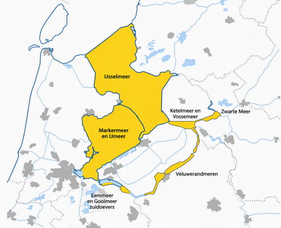
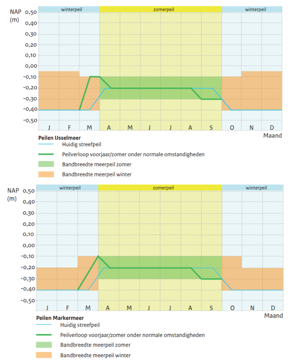
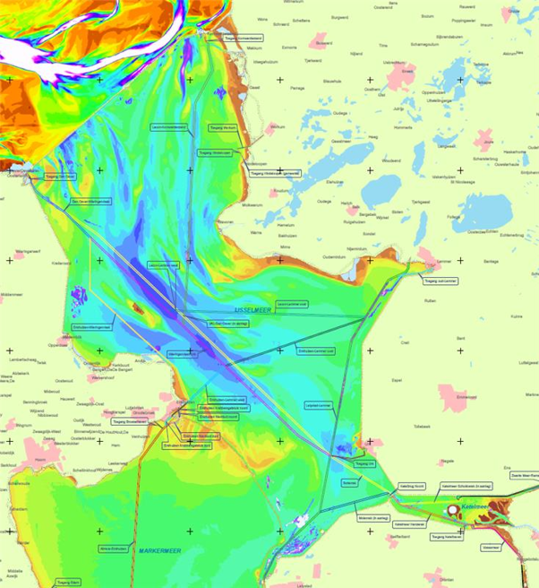
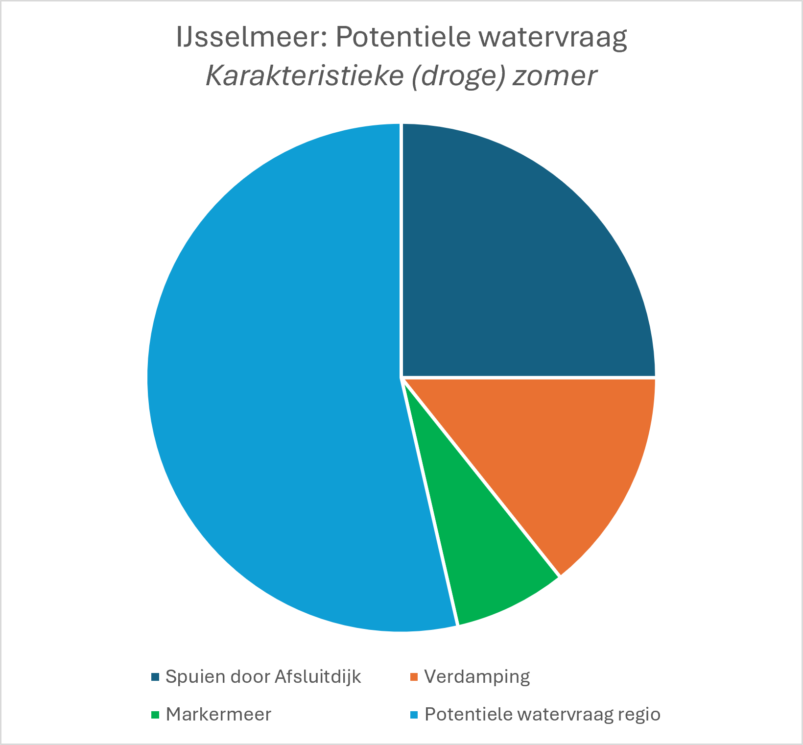
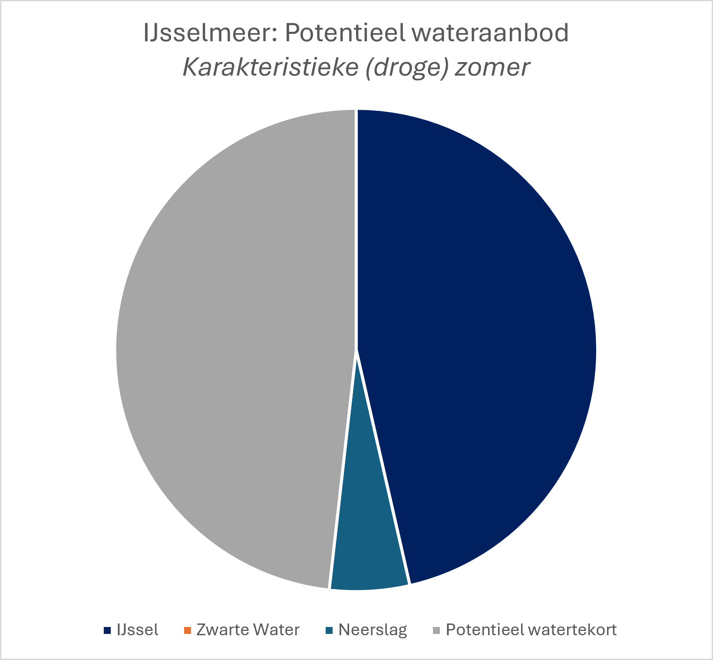
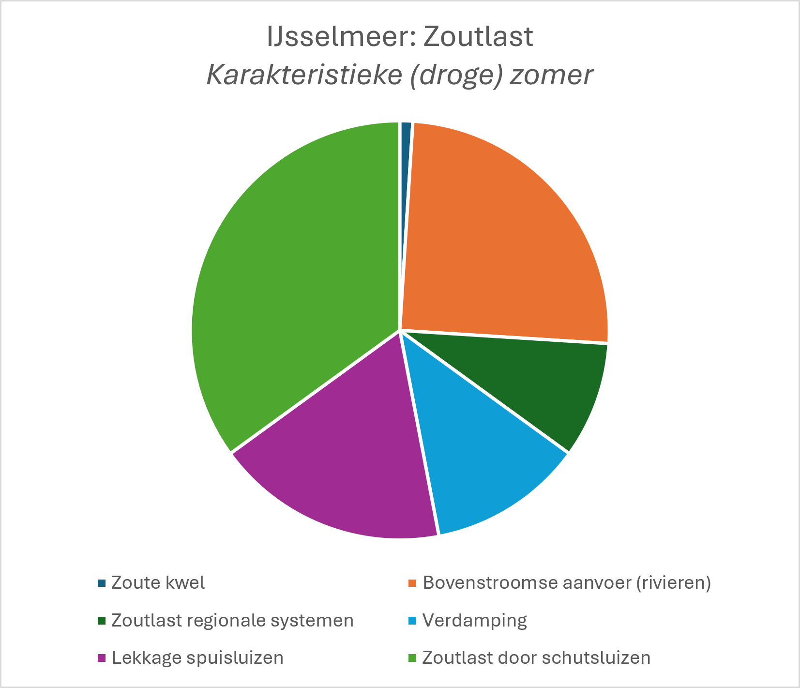
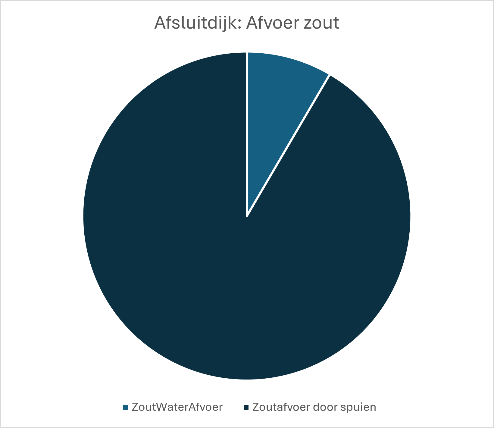
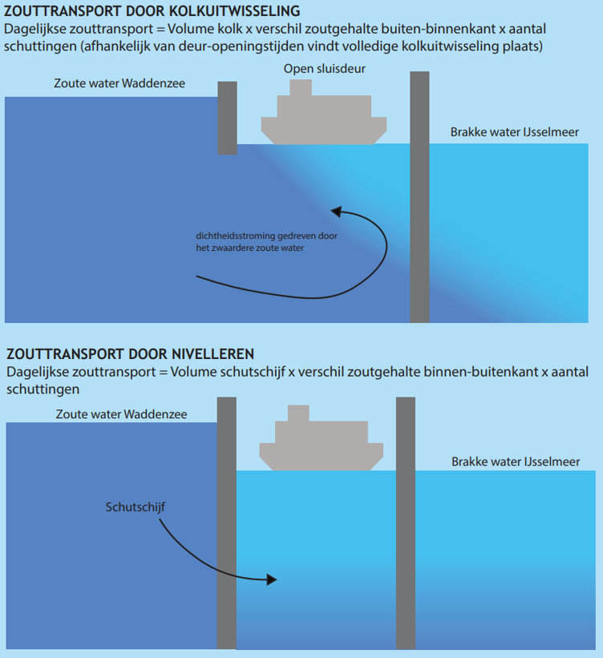
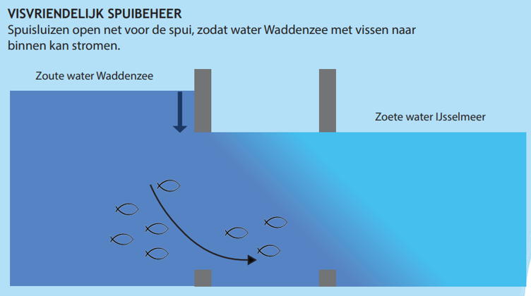

\newpage

# Systeembeschrijving, processen en beheermaatregelen {#systeemanalyse}

```{r setupSysteemanalyse, include = FALSE}

theme_wq = theme_bw()
```
Dit hoofdstuk beschrijft het IJsselmeergebied, de belangrijkste fysische processen, de bedreigingen en risico’s, en mogelijke beheermaatregelen en handelingsperspectieven. De tekst in dit hoofdstuk is grotendeels gebaseerd op de volgende bronnen: RWS (2021), RWS (2020) en Deltares (2024). 

## Systeembeschrijving

### IJsselmeergebied
Het IJsselmeergebied is het grootste zoetwaterreservoir van Nederland en vervult een belangrijke functie binnen het nationale waterbeheer. Het gebied bestaat uit het IJsselmeer, het Markermeer en de Randmeren (zie Figuur \@ref(fig:overzichtskaart)). Deze rapportage richt zich primair op de verzilting van het IJsselmeer en voor zover kennis en data bekend is, wordt het Markermeer ook meegenomen.

```{r overzichtskaart, echo=FALSE, fig.cap="Overzichtskaart IJsselmeergebied."}

```

Het IJsselmeer staat via verschillende verbindingen in contact met omliggende watersystemen: 
- De Waddenzee, via de Afsluitdijk. Hier bevinden zich drie schutsluizen: de Stevinsluis bij Den Oever en de Grote en Kleine Sluis bij Kornwerderzand. Daarnaast vindt waterafvoer plaats via de spuisluizen bij Den Oever (Stevinsluizen) en Kornwerderzand (Lorentzsluizen). In de toekomst zal een extra verbinding worden gerealiseerd via de Vismigratierivier.
- Het Markermeer via de Houtribdijk. De verbinding tussen beide meren wordt gevormd door de Krabbersgatsluizen bij Enkhuizen en de Houtribsluizen bij Lelystad. 
- Het Ketelmeer is via een open verbinding bij de Ketelbrug gekoppeld aan het IJsselmeer. 

Het Markermeer staat in verbinding met:
- Het IJsselmeer via de Houtribdijk. 
- Het Noordzeekanaal via de Oranjesluizen.
- Het Gooimeer via een open verbinding bij de Hollandse Brug.

### Functies
Het IJsselmeergebied vervult verschillende functies, die hieronder verder worden toegelicht.

**Zoetwatervoorziening:**
Het IJsselmeer en Markermeer vervullen een belangrijke functie voor de zoetwatervoorziening van een groot deel van West-, Noord- en Oost-Nederland. De meren vormen een zoetwaterbuffer voor drinkwaterproductie, landbouw, industrie en het doorspoelen van regionale watersystemen. 

Een belangrijke drinkwaterinname bevindt zich bij Andijk, waar drinkwaterbedrijf PWN oppervlaktewater uit het IJsselmeer gebruikt voor de productie van drinkwater. Ongeveer 70% van het drinkwater voor Noord-Holland, met uitzondering van Amsterdam, komt hiervandaan. Daarmee zijn circa 1,1 miljoen inwoners afhankelijk van deze inname. Daarnaast wordt op deze locatie proceswater geproduceerd voor industrieel gebruik. Voor zowel het ingenomen oppervlaktewater als het geproduceerde drinkwater geldt een jaargemiddelde chloridenorm van 150 mg/l. De omgang met tijdelijke overschrijdingen van deze norm is vastgelegd in de Handleiding Normering Chloride Drinkwater(bronnen).

Het Markermeer speelt een belangrijke rol voor de zoetwatervoorziening van het Hoogheemraadschap Hollands Noorderkwartier en Waterschap Amstel, Gooi en Vecht. Hoewel de huidige waterkwaliteit niet volledig voldoet aan de normen voor drinkwaterproductie, is het Markermeer wel aangewezen als strategische reserve voor toekomstige drinkwatervoorziening.

**Waterbeheer en waterveiligheid:**
De meren fungeren als buffer en bieden ruimte voor tijdelijke waterberging tijdens perioden met hoge rivierafvoeren en extreme neerslag. 

**Visserij en visbeheer:**
Het IJsselmeer en Markermeer vervullen een functie voor de beroepsvisserij en het visbeheer. Rijkswaterstaat staat gesteld voor de taak om vismigratie via de Afsluitdijk mogelijk te maken (Europese Kaderrichtlijn Water) en neemt daartoe verschillende maatregelen:
- Visvriendelijk spuisluisbeheer: een aantal spuikokers gaan enkele minuten voorafgaand aan de spui al open. 
- Visvriendelijk schutten: de deuren van de scheepvaartsluizen worden in de nacht om en om enige tijd open gezet. 
- Spuien om visstand: de deuren van de spuisluizen worden (bij laagwater Waddenzee) op een kier gezet. Hierdoor kunnen sterke zwemmers tegen de stroming in van de Waddenzee naar het IJsselmeer zwemmen. 
- Vismigratierivier: dit wordt een kilometerslange slingerende rivier, dwars door de Afsluitdijk. Hierdoor kunnen trekvissen wanneer ze maar willen van de Waddenzee naar het IJsselmeer zwemmen. Naar verwachting zwemmen de eerste vissen in 2027 door de Vismigratierivier.

**Overige functies:**
Het IJsselmeergebied heeft daarnaast belangrijke functies voor natuur, scheepvaart en recreatie. Het gebied herbergt beschermde natuur en diersoorten, verbindt de binnenwateren met de Waddenzee en biedt ruimte aan beroepsvaart, pleziervaart en diverse vormen van water- en oeverrecreatie.

### Peilbeheer
Voor het IJsselmeer gelden seizoensafhankelijke streefpeilen, zodat het peilbeheer kan worden afgestemd op wisselende weersomstandigheden en functies (zie Figuur \@ref(fig:streefpeilen)).

In de zomerperiode, van april tot en met september, wordt een hoger peil aangehouden dan in de winter. Dit zorgt voor een zoetwaterbuffer voor onder meer drinkwaterproductie, landbouw, doorspoeling van polders en recreatie. De boven- en ondergrens van het zomerpeil zijn respectievelijk -0,1 m +NAP en -0,3 m +NAP.

Aan het einde van de zomer wordt het peil verlaagd, zodat in de winter meer ruimte beschikbaar is om overtollig water op te vangen. De ondergrens van het winterpeil is -0,4 m +NAP.

Ook voor het Markermeer gelden seizoensafhankelijke streefpeilen. In de zomer zijn deze gelijk aan die van het IJsselmeer. In de winter liggen de streefpeilen vrijwel op hetzelfde niveau, maar is de bandbreedte kleiner.

```{r streefpeilen, echo=FALSE, fig.cap="Weergave van streefpeilen en bandbreedtes uit het peilbesluit van 2018 voor IJsselmeer en Markermeer. Bron: Deltares, 2025b"}

```

### Bodemligging
Figuur \@ref(fig:bodemligging) toont de bodemligging van het IJsselmeer en een deel van het Markermeer. De bodem van het IJsselmeer bestaat uit een relatief vlakke bodem met een gemiddelde diepte van circa 4 tot 5 meter, afgewisseld door diepere oude getijdegeulen, vaargeulen en lokale erosiekuilen nabij de spuisluizen op de Afsluitdijk. 

```{r bodemligging, echo=FALSE, fig.cap="Kaart van de bodemligging van het IJsselmeer. Bron: Rijkswaterstaat (2020)."}

```

### Water aan- en afvoer
**Afvoer IJssel:**
De IJssel is de grootste wateraanvoer voor het IJsselmeer (en via het IJsselmeer ook voor het Markermeer) in droge periodes. De IJsselafvoer is afhankelijk van de Bovenrijnafvoer bij Lobith en kan in enige mate worden gestuurd door stuw Driel. Bij een Bovenrijnafvoer van ongeveer 2600 m<sup>3</sup>/s gaat stuw Driel steeds verder dicht, waardoor zo lang mogelijk wordt gestuurd op ten minste 285 m<sup>3</sup>/s afvoer via de IJssel. Onder de 1590 m<sup>3</sup>/s bij Lobith staan de vizierschuiven van stuw Driel geheel dicht en wordt vrijwel al het water van het Pannerdensch Kanaal naar de IJssel gestuurd. De IJsselafvoer daalt dan mee met de afvoer van de Bovenrijn. 

**Spuisluizen Afsluitdijk:**
De grootste afvoer van water uit het IJsselmeer is via de spuisluizen bij Den Oever (Stevinsluizen) en Kornwerderzand (Lorentzsluizen) in de Afsluitdijk. De Stevinsluizen bestaan uit drie spuigroepen en de Lorentzsluizen uit twee spuigroepen. Elke spuigroep omvat vijf kokers van 12 m breedte, gescheiden door tussenpijlers van 4 m breed. Deze spuisluizen lozen overtollig water onder vrij verval naar de Waddenzee. Recent (sinds 2024) wordt gewerkt aan aanvullende maal- en spuicapaciteit om overtollig water vanuit het IJsselmeer naar de Waddenzee af te voeren.  

**Spuisluizen Houtribdijk:**
Het waterpeilverschil tussen het IJsselmeer en het Markermeer wordt gereguleerd met de spuisluizen in de Houtribdijk bij Lelystad (Houtribsluizen) en bij Enkhuizen (Krabbersgatsluizen). Bij een grote watervraag wordt water vanuit het IJsselmeer naar het Markermeer aangevoerd. Als de watervraag beperkt is, wordt overtollig water vanuit het Markermeer via het IJsselmeer afgevoerd. Daardoor is de bijdrage aan de waterbalans van het IJsselmeer in de winter positief door de aanvoer van water en in de zomer negatief door de afvoer van water van het Markermeer. 

**Neerslag:**
Ook neerslag heeft een invloed op het meerpeil. De gemiddelde hoeveelheid neerslag in Nederland is ongeveer 800 à 900 mm/jaar, met de natste maanden (ongeveer 80 mm/maand) tussen augustus en december, en de droogste maanden (ongeveer 40 à 60 mm/maand) in het voorjaar. 

**Verdamping:**
In droge zomerperiodes verdampt netto water uit het IJsselmeer. Dit heeft effect op het watervolume en, omdat opgeloste stoffen achterblijven, op het zoutgehalte. Gedurende een typische warme zomerdag is het verdampingsdebiet 40 m<sup>3</sup>/s (of wel 0.3 - 0.4 cm/d waterschijf). De concentratieverhoging als gevolg van verdamping is ongeveer 0.05 mg/l chloride per dag, wat overeenkomt met een willekeurige chloridevracht van ongeveer 6 kg/s. 

**Regionale watervraag:**
De regionale watervraag is zeer afhankelijk van het weer (neerslag, temperatuur). De regionale watervraag is vooral groot tijdens droge perioden, wanneer neerslagtekorten oplopen en de natuurlijke aanvoer van zoet water afneemt.

### Zoutbeheer
Als norm voor de chlorideconcentratie in het IJsselmeer wordt 150 mg/l jaargemiddeld bij innamepunt Andijk gehanteerd. Dit is momenteel de meest bepalende norm voor het beheer van het IJsselmeer. Op dagbasis mag de chlorideconcentratie oplopen tot 200 mg/l, mits dit niet langer dan 30 dagen aanhoudt én aan de jaargemiddelde norm voor drinkwater wordt voldaan. Het tegengaan van zoutverspreiding in het meer is een van de doelen van het operationele waterbeheer, omdat onder andere via de schut- en spuisluizen in de Afsluitdijk zout water op het IJsselmeer komt. Dit komt deels door dagelijks gebruik, deels als gevolg van lekkage, en deels door maatregelen om vismigratie te bevorderen.

Verhoogde chlorideconcentraties op het Markermeer komen met name door de afvoer van zout kwelwater vanuit Flevoland en het Noordzeekanaal (vistrap en schutverliezen bij een lage of gelijke Markermeer waterstand). Het afvoeren van Markermeerwater via de Oranjesluizen (uitwateringssluis) en het Noordzeekanaal kan bijdragen aan de doorspoeling van het Markermeer. Dit is alleen mogelijk als de waterstand op het Markermeer hoger is dan op het Noordzeekanaal (normaliter in zomerperiode).

### Water- en zoutbalans
De Waterbalans voor het IJsselmeer is voor een karakteristieke zomerperiode afgeleid. (zie https://iplo.nl/thema/water/documenten/beheer-watersysteem-waterketen/verzilting/infographics-verzilting-ijsselmeer-markermeer/). 

De totale watervraag wordt in de zomer voor een groot deel bepaald door de regionale watervraag (Hydrologic, 2021), maar ook een substantieel deel is nodig voor het tegengaan van verzilting (Spuien door Afsluitdijk). Hoeveel precies gespuid moet worden is nog onzeker, en verder onderzoek (Deltares, 2026) zal inzicht geven in wat de meest effectieve spuistrategie kan zijn om verzilting tegen te gaan. Tot slot is verdamping en de watervraag vanuit het Markermeer ook substantieel.

```{r watervraag, echo=FALSE, fig.cap="Watervraag IJsselmeer in (droge) zomer."}

```

Het wateraanbod is tijdens een zomerperiode beperkt. Deze wordt gedomineerd door de aanvoer vanaf de IJssel (hier aangenomen op 130 m<sup>3</sup>/s). Doordat neerslag beperkt is, en ook vanaf het Zwarte Water geen toevoer naar het IJsselmeer is er sprake van een aanzienlijk watertekort (orde grootte 135 m<sup>3</sup>/s) welke moet worden opgevangen door het laten uitzakken van het meerpeil.

```{r wateraanbod, echo=FALSE, fig.cap="Wateraanbod IJsselmeer in (droge) zomer."}

```

De zoutbalans van het IJsselmeer laat een groot aantal redelijk vergelijkbare bijdrages zien. Met name de zoutlast door schut- en spuisluizen is hierbij van belang. De bovenstroomse aanvoer is onvermijdelijk en wordt veroorzaakt doordat rivierwater (zeker bij lage afvoeren) een niet verwaarloosbaar zoutgehalte heeft. Let wel: Verdamping leidt niet op zichzelf tot verzilting, maar doordat het water uit het meer onttrekt, wordt het nog aanwezige zoute water wel steeds zouter.

```{r zoutlast, echo=FALSE, fig.cap="Zoutlast IJsselmeer in (droge) zomer."}

```

De afvoer van verzilting moet grotendeels gebeuren via de spuisluizen, al wordt een klein deel ook gedaan via de hevels. Bij een watertekort, kan minder water worden gespuid, waardoor minder zout water kan worden afgevoerd en de verzilting in het IJsselmeer zal toenemen.

```{r zoutafvoer, echo=FALSE, fig.cap="Zoutafvoer IJsselmeer in (droge) zomer."}

```

## Belangrijkste fysische processen
**Schut- en spuisluizen:**
De schut- en spuisluizen in de Afsluitdijk zijn de grootste bron van zout water op het IJsselmeer. Aan de IJsselmeerzijde verzamelt dit zwaardere zoute water zich in eerste instantie in de vaargeulen van de schutsluizen en in de erosiekuilen achter de spuisluizen. Deze diepe delen fungeren als een tijdelijke zoutvang. Zolang voldoende kan worden gespuid, ontstaat een dynamisch evenwicht tussen de zoutaanvoer via de sluizen en de zoutafvoer naar de Waddenzee.

Via de scheepvaartsluizen in de Afsluitdijk komt zout water op het IJsselmeer met name als onderdeel van het schutbedrijf en ook via enige lekkage. Zouttransport vindt plaats tijdens het nivelleerproces rond hoogwater en tijdens de kolkuitwisseling bij het openen van de sluisdeuren (zie Figuur \@ref(fig:zouttransportsluizen)). De kolkuitwisseling is veruit het dominante proces vanwege het grote volume van de kolk in vergelijking met de schutschijf. Bij Den Oever ligt één scheepvaartsluis (de Stevinsluis) en bij Kornwerderzand liggen een grote en een kleine scheepvaartsluis (de Lorentzsluizen). Behalve de grootte van de kolk is de zoutlast via de scheepvaartsluizen afhankelijk van de precieze schutoperatie en de sterk variabele chlorideconcentratie in de westelijke Waddenzee. In de praktijk speelt hierbij de afweging tussen kortere deur-openingstijden, het beperken van het aantal schutbewegingen per dag, het aantal schepen in de kolk en de doorstroom van het scheepvaartverkeer. (zoals deur-opentijden en aantal schutbewegingen). 

```{r zouttransportsluizen, echo=FALSE, fig.cap="Zouttransport door kolkuitwisseling en nivelleren."}

```

Het aanpassen van het schutregime behoort in extreme situaties tot de afwegingen om de zoutlast op het IJsselmeer te beperken. In de praktijk speelt de afweging tussen kortere deur-openingstijden, het beperken van het aantal schutbewegingen per dag, het aantal schepen in de kolk en de doorstroom van het scheepvaartverkeer. Het beperken van het aantal cycli (schutten met volle kolken) lijkt een licht positief effect te hebben op het beperken van de zoutlast. 

Via de spuisluizen komt zout water op het IJsselmeer door lekkages bij de afdichtingen van de deuren. Het lekdebiet varieert met de waterstand op de Waddenzee (afhankelijk van getij en windeffecten). De zoutvracht varieert met het lekdebiet en de chlorideconcentratie aan de Waddenzeezijde. Die concentratie is afhankelijk van windeffecten en stromingspatronen op de Waddenzee, en de concentratie is hoger naarmate langer niet is gespuid. Een belangrijke maatregel om de zoutlast via de lekkages te beperken is het plaatsen en onderhouden van slabben en onderafdichtingen op de spuideuren, daarnaast kan helpen om zowel de eb- als vloeddeuren te sluiten (deuren dubbel dicht). Daarnaast kan ook zout water op het IJsselmeer komen door de maatregel visvriendelijk spuibeheer. 

Zolang voldoende kan worden gespuid, blijft de verzilting beperkt tot de erosiekuilen en de vaargeulen nabij de Afsluitdijk. Als enige tijd slechts beperkt wordt gespuid, bijvoorbeeld in periodes van watertekort, ontstaat het risico op zoutverspreiding naar de rest van het meer.

**Vismigratie en verzilting:**
Enkele maatregelen ten behoeve van de vismigratie zorgen voor een instroom van zout water. De opgave is deze zoutlast dan ook weer af te voeren voordat het op de rest van het meer kan komen.
- Visvriendelijk spuisluisbeheer: jaargemiddelde zoutvracht: 25-75 kg/s etmaalgemiddeld. Als deze maatregel wordt ingezet gaat een aantal spuikokers enkele minuten voorafgaand aan de spui al open. Dit gebeurt voornamelijk in het winterhalfjaar. Voor het zomerhalfjaar wordt onderzocht hoe en wanneer het visvriendelijk spuibeheer kan worden gecombineerd met verziltingsbestrijding (aanvullend op de bestaande afvoer onder vrij verval via de hevels). 
- Visvriendelijk schutten: jaargemiddelde zoutvracht: 10-20 kg/s etmaalgemiddeld. Als deze maatregel wordt ingezet, worden de deuren van de scheepvaartsluizen in de nacht om en om enige tijd open gezet. Er wordt echter nog onderzocht welke combinatie van maatregelen het beste werkt om de zoutlast af te voeren die hiermee op het meer komt. 
- Spuien om visstand: als deze maatregelen wordt ingezet, worden de deuren van de spuisluizen (bij laagwater Waddenzee) op een kier gezet. Hierdoor kunnen sterke zwemmers tegen de stroming in van de Waddenzee naar het IJsselmeer zwemmen. Als (bijvoorbeeld in de zomerperiode) uitsluitend op visstand wordt gespuid vraagt dit enig zoetwater, maar de stroomsnelheden zijn dusdanig laag dat het niet bijdraagt aan verziltingsbestrijding. Spuien op visstand helpt niet voor verziltingsbestrijding.
- Vismigratierivier: deze rivier is zo ontworpen dat er geen zout water op het IJsselmeer terecht moet komen. 

```{r visvriendelijkspuibeheer, echo=FALSE, fig.cap="Schematische weergave van visvriendelijk spuibeheer."}

```

**Verhoogde achtergrondconcentratie IJssel bij lage Rijnafvoeren:**
Bij lage rivierafvoeren neemt de achtergrondconcentratie van chloride in het rivierwater toe. Bij een Bovenrijnafvoer (Lobith) onder 800 m<sup>3</sup>/s kan de achtergrondconcentratie boven de 150 mg/l komen. Onder dergelijke omstandigheden kan het meerwater niet verder worden verdund dan de verhoogde chlorideconcentratie van het instromende rivierwater. Als deze situatie lange tijd aanhoudt, kan dit een aandachtspunt zijn voor de gebruiksfuncties op het IJsselmeer (en ook voor het Markermeer), waarbij de drinkwatervoorziening (innamelocatie Andijk) het meest bepalend is.

**Bijdrage zoutlast regionale watersystemen:**
De totale bijdrage van de regionale watersystemen aan de zoutlast op het IJsselmeer is relatief beperkt. Met name vanuit de beheergebieden van Waterschap Zuiderzeeland, Wetterskip Fryslân en het Hoogheemraadschap Hollands Noorderkwartier wordt brak water uitgeslagen waardoor water met een verhoogde chlorideconcentratie op het IJsselmeer (en Markermeer) komt. 

**Afvoer Wieringermeer:**
In de buurt van de drinkwaterinname bij Andijk ligt gemaal Lely. De bijdrage aan de zoutlast op het IJsselmeer is relatief beperkt. Het water uit de zoutere delen van de Wieringermeer wordt namelijk via een ander gemaal (Leemans bij Den Oever) sinds 1994 rechtstreeks afgevoerd naar de Waddenzee. Alleen in geval van piekbelasting en storingen wordt gemaal Lely ingezet voor bemaling van de gehele Wieringermeer en kan relatief zout polderwater in het IJsselmeer uitgeslagen worden. Met drinkwaterbedrijf PWN zijn nadere afspraken gemaakt over de monitoring van de chlorideconcentraties in dergelijke situaties om tijdig in te kunnen grijpen.

**Verspreidingsprocessen:**
Het IJsselmeer is over het algemeen een verticaal goed gemengd systeem door wind en stromingspatronen. Uitzondering hierop zijn de diepe delen vlakbij de Afsluitdijk. Daar bevindt en verplaatst het zoute water zich vooral via de diepere delen. 

Veranderingen in de waterkwaliteit in het IJsselmeer (en Markermeer) manifesteren zich onder droge omstandigheden op een tijdschaal van weken tot maanden door het grote volume van de meren in verhouding tot de aan- en afvoeren. Dit is zowel een voordeel als een nadeel: een verhoogde zoutlast zorgt voor een relatief trage verhoging van de chlorideconcentratie in het grote volume van het IJsselmeer, maar als de chlorideconcentraties in het meer eenmaal verhoogd zijn, is het handelingsperspectief beperkt en duurt het lang voordat de bekkens zijn doorgespoeld met zoeter water. Op het Markermeer is de verblijftijd nog hoger dan op het IJsselmeer.

## Bedreigingen en risico's
Enkele voorziene ontwikkelingen die relevant zijn voor de verzilting en verziltingsbestrijding op het IJsselmeer: 
- De scheepvaartsluis bij Kornwerderzand staat op de planning om te worden vergroot, waarbij ook de vaargeul wordt verdiept. Voor dit project geldt als uitgangspunt dat verzilting op het meer niet mag toenemen als gevolg van de nieuwe sluis. 
- Het meetnet is naar aanleiding van de droge zomer van 2018 al uitgebreid, maar zal in de komende tijd nog verder worden aangepast en aangevuld. Dit is wenselijk om verziltingsrisico’s tijdig te kunnen signaleren en meer inzicht op te doen. Onderzocht wordt hoe het meest effectief zout water  vanuit de erosiekuilen achter de spuisluizen en verder in het meer kan worden afgevoerd. 
- Er komt aanvullende spui en  pompcapaciteit bij Den Oever. Daar worden afvoerkokers aangelegd die dieper liggen. Wat dit betekent voor de zoutlast op het IJsselmeer en hoe dit te beheersen (bijvoorbeeld door inzet van de nieuwe pompen) wordt onderzocht.
- Klimaatverandering is van invloed op de waterbeschikbaarheid in het hoofdwatersysteem en op de watervragen. Daarnaast kan zeespiegelstijging zorgen voor een extra zoutlast en beperkingen in de spuicapaciteit. Wat dit betekent voor de landelijke waterverdeling en de zoetwatervoorziening vanuit het hoofdwatersysteem wordt uitgewerkt in de landelijke zoetwaterstrategie.

## Maatregelen en handelingsperspectieven
**Spuistrategie: peilbeheer en verziltingsbestrijding:**
Een groot deel van het jaar voeren de spuisluizen in de Afsluitdijk water af van het IJsselmeer naar de Waddenzee voor peilhandhaving. Daarmee wordt ook zoutverspreiding vanaf de Afsluitdijk naar de rest van het IJsselmeer tegengegaan. Het zoute water moet worden afgevoerd voordat het zich over de rand van de erosiekuilen en via de vaargeulen verspreidt (zwaartekrachtstroming), of grootschalige windgedreven stromingen en menging vat krijgen op het zoutere water in de diepere delen van de waterkolom. Om niet te veel zoet water te gebruiken moet in de spuistrategie een balans worden gevonden tussen het spuidebiet (groter spuidebiet betekent hogere stroomsnelheden en daardoor meer afvoer zout water uit de diepe delen), en de spuifrequentie (regelmatige frequentie is belangrijk om overlopen van de kuil te voorkomen). Als de watervraag om zoutverspreiding tegen te gaan daarbij conflicteert met de andere watervragen, vraagt dit om een nadere afweging van RDO partners. Er wordt onderzoek gedaan naar de meest efficiënte spuistrategie om zoutverspreiding tegen te gaan met zo min mogelijk peilverlies. Ook wordt nagedacht over aanvullende infrastructurele maatregelen om de verzilting te beperken. Hiertoe zijn voorstellen gedaan in het kader van het Deltaprogramma Zoetwater.

In de zomerperiode is de spuistrategie erop gericht de zoetwatervoorziening te borgen. Dit gaat enerzijds om de waterkwantiteit: tijdige peilopzet om periodes van watertekort langer te kunnen overbruggen. Anderzijds gaat het om verziltingsbestrijding: spuistrategie gericht op het voorkomen van verspreiding van het zoute water uit de vaargeulen en erosiekuilen naar de rest van het meer. Ook in periodes van watertekort blijft spuien het meest effectief om zoutverspreiding naar de rest van het meer te voorkomen. 

Om de zoutlast door de spuisluizen te beperken is het sluiten van de beide spuideuren in de spuikokers (deuren ‘dubbeldicht’) een maatregel (effectiviteit ingeschat op 30 procent reductie van de zoutlast). Daarnaast is het tijdelijk stoppen met visvriendelijk spuibeheer een van de maatregelen die wordt overwogen. 

**Hevels:**
Hevels dragen bij aan de afvoer van zout water uit de erosiekuilen achter de spuisluizen, maar hebben niet de capaciteit om het effect van spuien over te nemen. Vanuit de diepere delen van de erosiekuilen vindt bij laagwater op de Waddenzee zoutwaterafvoer onder vrij verval plaats via hevels. Doel van het hevels is het visvriendelijk spuibeheer mogelijk te maken, waarbij een zoutlast op het IJsselmeer mag komen die met de hevels kan worden afgevoerd (capaciteit ongeveer 0.25 m<sup>3</sup>/s). 

**Schutsluizen:**
Maatregelen om zoutindringing via de schutsluizen te verminderen zijn het gebruik van bellenschermen, spoelen door de kolk, sturen op korte deur-open-tijden, mogelijk in combinatie met minder schuttingen. 

**Meet- en monitoringsnetwerk:**
Indien het zoute water uit de erosiekuilen en vaargeulen zich verspreidt in het meer, is het handelingsperspectief beperkt. Verversing van het meer kost veel tijd (ervaring 2018: enkele maanden tot een half jaar). Naast bronmaatregelen blijft de meest effectieve maatregel tegen zoutverspreiding het voorkómen van verdere verspreiding uit de erosiekuilen en vaargeulen. Om het vollopen van de kuilen tijdig te signaleren is een meet- en monitoringsnetwerk in en nabij de kuilen ingericht. Zo worden de chlorideconcentraties op vier dieptes in de erosiekuilen gemonitord en wordt in de zomer periodiek aanvullende monitoring vanaf schepen uitgevoerd. Op die manier kan tijdig de afweging worden gemaakt om in te grijpen, voordat verdere verspreiding optreedt.
