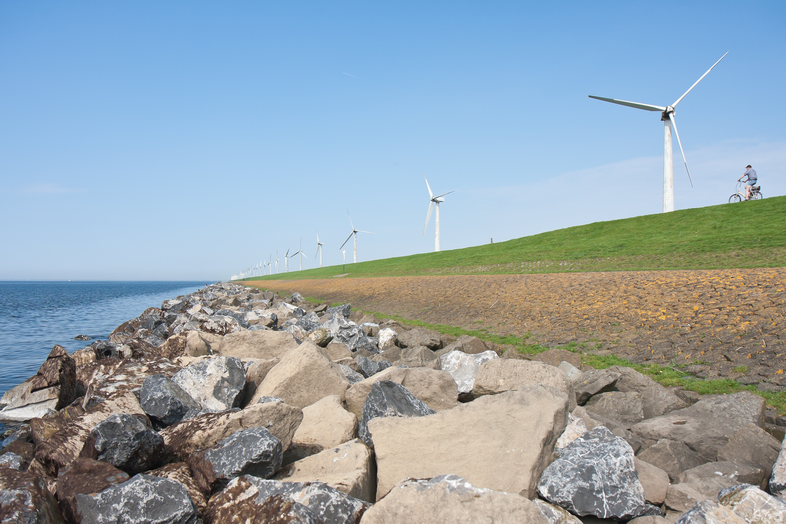

#  {.unnumbered}

<!-- # Voorwoord {- #voorwoord} -->

!!! DIT IS EEN TESTVERSIE !!!

Hier vindt u een overzicht van actuele en historische data en trends over de ontwikkeling van de abiotische (niet-levende) natuur in de Waddenzee, zoals waterstanden, waterkwaliteit en morfologische ontwikkeling.


```{r voorplaat, width = "100%", fig.cap="(ref:voorplaatLabel)"}
# ```{r voorplaat, width = "100%", fig.cap="IJsselmeer"}

```


### Nederlands {-}

Deze watersysteemrapportage is een initiatief van:

-   Rijkswaterstaat
    -   Noord-Nederland
    -   WVL
-   Deltares

Deze digitale Systeemrapportage van de Wadden is opgezet als een naslagwerk, om te voldoen aan de eerste informatiebehoefte voor beheerders, gebruikers en onderzoekers van de Waddenzee. Het bevat indicatoren die de toestand en trends van het natuurlijke abiotische systeem beschrijven, en die invloed hebben op de natuurlijkheid van het Waddensysteem. Dat maakt dat ze relevant zijn voor de verschillende beheer- en beleidsdoelen in het Waddengebied.

Let op: op dit moment is alleen de inleiding beschikbaar in het Engels en Duits. De vertaling van de delen die de indicatoren beschrijven kan niet worden geautomatiseerd en is daarom te arbeidsintensief om bij elke update te worden gecontroleerd. We hopen dat desondanks de toegang tot de informatie en een mogelijke vertaling door de gebruiker voldoende functionaliteit biedt.

Informatie uit deze Digitale Systeemrapportage kan als volgt geciteerd worden: "Stolte, W., Vroom, J., Santinelli, G., Veenstra, J., Van Oeveren, C., Van Zelst, V. and Dijkstra, J. (2023). Digitale Systeemrapportage van de Waddenzee, versie 1.0. <https://systeemrapportage.nl/wadden/>".

Als u gebreken of onvolledigheden constateert horen wij dat graag via: carlijn.meijers -at- deltares.nl en/of martijn.kleinobbink -at- rws.nl.

### English {-}


This water system report is an initiative of:

-   Rijkswaterstaat
    -   Northern Netherlands
    -   WVL
-   Deltares

This digital Wadden Sea System Report is designed as a reference work, to meet the initial information needs for managers, users and researchers of the Wadden Sea. It contains indicators that describe the state and trends of the natural abiotic system, and that affect the naturalness of the Wadden system. This makes them relevant for different management and policy goals in the Wadden Sea region.

Please note that for now, only the Introduction is available in English and German. The translation of the sections describing the indicators cannot be automated, hence is too labour intensive to be checked with every update. We hope that despite this, the access to the information and a possible translation by the user provides sufficient functionality.

Information from this Digital System Report can be quoted as follows: "Stolte, W., Vroom, J., Santinelli, G., Veenstra, J., Van Oeveren, C., Van Zelst, V. and Dijkstra, J. (2023). Digital System Report of the Wadden Sea, version 1.0. <https://systeemrapportage.nl/wadden/>".

If you notice any deficiencies or incompleteness we would be pleased to hear from you at: carlijn.meijers -at- deltares.nl and/or martijn.kleinobbink -at- rws.nl.